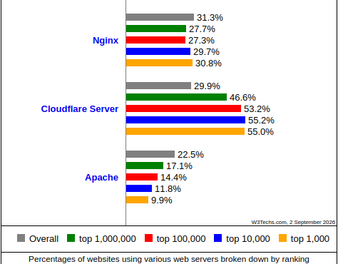

# **Arquitectura Web. Implantación y administración de servidores web**

## Introducción

Con la evolución y el acceso libre a Internet, uno de los principales alicientes que han surgido es la publicación de páginas web donde se pueden almacenar contenidos atractivos para nosotros y que, al mismo tiempo, pueden ser consultados desde cualquier parte del mundo.

Las páginas web, en su mayoría en formato HTML, requieren ser alojadas en máquinas que dispongan de espacio en disco para almacenar archivos HTML, imágenes, bloques de código o archivos de vídeo en directorios específicos y, al mismo tiempo, deben ser capaces de entender todo tipo de extensiones de los archivos que son enviados en ambos sentidos de la comunicación.

{: style="height:450px;width:550px"}

No podemos dejar de lado la importancia de las medidas de seguridad ante los peligros existentes en Internet. Las páginas deberán estar diseñadas considerando la incorporación de protocolos de comunicación seguros como HTTPS (Hyper Text Transfer Protocol secure) que utilizan claves y estrategias de cifrado propias de TLS (Transport Layer Security).

Las máquinas que alojan las páginas web reciben la categoría de **servidores web**. Los requerimientos más relevantes son el espacio de disco necesario para almacenar la estructura de la página web y una buena conexión de red para que el consumo de CPU sea bastante bajo.

El funcionamiento de los servidores web es especial ya que, como si se tratara de un diente de sierra, tienen consumos de recursos puntuales porque podemos estar un tiempo sin peticiones y, de repente, tener una avalancha de peticiones. Esto hace que los servidores web suelan tener un número bajo de procesos en espera. A medida que resultan necesarios, se van arrancando nuevos.

> **Nota:** Las páginas web que ejecutan programas de interacción con el usuario o requieran cifrado (HTTPS) consumen más recursos que otras páginas con menos interacción.

## ¿Qué es un servidor web?

Los servidores web sirven para almacenar contenidos de Internet y facilitar su disponibilidad de forma constante y segura. Cuando visitas una página web desde tu navegador, es en realidad un servidor web el que envía los componentes individuales de dicha página directamente a tu ordenador. Para que una página web sea accesible en cualquier momento, el servidor web debe estar permanentemente online.

{: style="height:300px;width:550px"}

Toda página accesible en Internet necesita un servidor especial para sus contenidos web. Las grandes empresas y organizaciones cuentan con un servidor web propio para disponer sus contenidos en Intranet e Internet. Sin embargo, la mayoría de administradores recurren a los centros de datos de proveedores de alojamiento web para sus proyectos.

### Tecnología de servidores web

El software de un servidor HTTP es el encargado de proporcionar los datos para la visualización del contenido web.

Para abrir una página web, el usuario solo tiene que escribir el URL correspondiente en la barra de direcciones de su navegador web. El navegador envía una solicitud al servidor web, quien responde entregando una página HTML. Esta puede estar alojada como un documento estático en el host o ser generada de forma dinámica, lo que significa que el servidor web tiene que ejecutar un código de programa (por ejemplo, Java, PHP o Node.js) antes de tramitar su respuesta.

El navegador interpreta la respuesta, lo que suele generar automáticamente más solicitudes al servidor a propósito de imágenes integradas o archivos CSS.


El protocolo utilizado para la transmisión es HTTP (o su variante cifrada HTTPS), que se basa en los protocolos de red IP y TCP. Un servidor web puede entregar los contenidos simultáneamente a varios navegadores web. La cantidad de solicitudes y la velocidad con la que pueden ser procesadas depende del hardware, la carga del host y la complejidad del contenido: los contenidos web dinámicos necesitan más recursos que los estáticos.


La selección del equipo adecuado para el servidor y la decisión de si este debe ser dedicado, virtual o en la nube, se debe hacer pensando siempre en evitar sobrecargas.

### Otras funciones de los servidores web

Aunque su principal función es la transferencia de contenido web, muchos programas de servidor web ofrecen características adicionales:

| Función | Descripción |
|---------|-------------|
| **Seguridad** | Cifrado de la comunicación entre el servidor web y el cliente vía HTTPS |
| **Autenticación** | Autenticación HTTP para áreas específicas de una aplicación web |
| **Redirección** | Redirección de solicitudes mediante Rewrite Engine |
| **Caché** | Almacenamiento en caché de documentos dinámicos para respuestas eficientes |
| **Cookies** | Envío y procesamiento de cookies HTTP |

> **Nota:** Además del software del servidor, un host puede contener otro tipo de programas, como un servidor FTP para la carga de archivos o un servidor de base de datos para contenidos dinámicos.

## El protocolo HTTP

### Historia

El protocolo de transferencia de hipertexto (HTTP, Hypertext Transfer Protocol) es el motor que da vida a Internet, ya que es la base para la web (World Wide Web).

La web fue creada en 1989 en el Consejo Europeo para la Investigación Nuclear (CERN), con sede en Ginebra. Este organismo disponía de una amplia plantilla de científicos de diferentes países que trabajan en sus aceleradores de partículas. Fue a raíz de la necesidad de disponer de múltiples grupos de científicos repartidos por el mundo y colaborando entre ellos que nació la web.


En los inicios del protocolo HTTP, a mediados del año 1990, encontramos la versión 0.9. Esta versión tenía como única finalidad transferir datos por Internet en forma de páginas web escritas en HTML. A partir de la versión 1.0 del protocolo surgió la posibilidad de transferir mensajes con encabezados que describían el contenido de los mensajes.

### Versiones del protocolo HTTP

#### HTTP/0.9 - La primera versión

La historia de HTTP empezó en 1989, cuando Tim Berners-Lee y su equipo del CERN desarrollaron la World Wide Web. La versión inicial de HTTP fue bautizada con el número de versión 0.9, consistía en una sola línea y solo permitía solicitar un archivo HTML del servidor cada vez. El servidor no hacía más que transferir el archivo solicitado.

#### HTTP/1.0 - El primer estándar

El estándar HTTP/1.0 incorporó la posibilidad de transferir mensajes con encabezados que describían el contenido, pero cada solicitud requería abrir una nueva conexión TCP, lo que resultaba ineficiente.

#### HTTP/1.1 - El estándar durante décadas

HTTP/1.1 aclaró ambigüedades y añadió numerosas mejoras que lo han mantenido como estándar durante años:

- **Conexiones persistentes**: Una conexión podía ser reutilizada, ahorrando el tiempo de re-abrirla repetidas veces.
- **Pipelining**: Se añadió la posibilidad de realizar una segunda petición de datos antes de que fuera respondida la primera, disminuyendo la latencia.
- **Responses divisibles**: Las respuestas a peticiones podían ser divididas en sub-partes.
- **Negociación de contenido**: Permite que servidor y cliente acordasen el contenido más adecuado a intercambiarse.
- **Cabecera Host**: Hizo posible alojar varios dominios en la misma dirección IP.

#### HTTP/2 - Mejora de rendimiento

Las páginas web se volvían cada vez más complejas. Para cargar una web moderna, el navegador tiene que solicitar muchos megabytes de datos y enviar hasta cien solicitudes HTTP. HTTP/1.1 está pensado para procesar solicitudes una tras otra en una misma conexión.

Google desarrolló el protocolo SPDY (Speedy), que permitió que en 2015 se publicara HTTP/2. Este estándar incluye múltiples mejoras para acelerar la carga de páginas web.

**Según datos de 2025, HTTP/2 es utilizado por aproximadamente el 45-50% de las páginas web.**


#### HTTP/3 - El protocolo actual

Un punto débil de todas las versiones anteriores de HTTP es el protocolo TCP en el que se basan. Este protocolo requiere que el receptor de cada paquete confirme la recepción antes de que pueda enviarse el siguiente. Basta con que se pierda un paquete para que todos los demás tengan que esperar.

HTTP/3 no funciona con TCP, sino con **UDP**, que no aplica este tipo de medidas correctivas. Sobre UDP se ha creado el protocolo **QUIC** (Quick UDP Internet Connections), que es la base de HTTP/3.

**En 2025, HTTP/3 es utilizado por aproximadamente el 50-60% de las páginas web y sigue en crecimiento.**

### QUIC: El transporte de HTTP/3

QUIC (Quick UDP Internet Connections) es un protocolo de transporte desarrollado por Google que solve varios problemas de TCP. Su nombre es un acrónimo recursivo, siguiendo la tradición de "GNU".

#### ¿Por qué UDP en lugar de TCP?

El problema fundamental de TCP es su mecanismo de control de congestión y la confirmación de paquetes. Cuando se pierde un paquete TCP, el receptor debe confirmar la recepción de todos los paquetes anteriores antes de continuar. Esto causa el conocido problema de **head-of-line blocking**: si el paquete 10 de una secuencia se pierde, todos los paquetes posteriores (11, 12, 13...) deben esperar a que el paquete 10 sea retransmitido, aunque lleguen correctamente al destino.

Imagina una línea de coches en un peaje. Si el primer coche no tiene ticket y debe buscar cambio, toda la cola detrás de él debe esperar, aunque los demás conductores tengan el importe exacto.

QUIC sobre UDP evita este problema porque UDP no tiene confirmación de recepción. QUIC implementa sus propios mecanismos de control de flujo y recuperación de errores a nivel de aplicación, permitiendo que si se pierde un paquete en un stream, los demás streams continúen sin interrupciones.

#### Cómo funciona QUIC

QUIC integra en un solo protocolo varias funciones que antes estaban repartidas entre TCP, TLS y HTTP:

1. **Establecimiento de conexión**: QUIC combina el handshake de TCP y TLS en un solo paso, reduciendo la latencia inicial. Una conexión QUIC puede establecerse en 1-RTT (una ida y vuelta) o incluso 0-RTT si el cliente ya se ha conectado antes.

2. **Multiplexación de streams**: Una sola conexión QUIC puede transportar múltiples streams independientes. Cada stream tiene su propio control de flujo y recuperación de errores. Esto significa que la pérdida de un paquete en el stream de imágenes no afecta al stream de JavaScript.

3. **Control de congestión**: QUIC implementa su propio control de congestión, más eficiente que TCP porque puede adaptarse a las condiciones de la red sin depender del kernel del sistema operativo.

4. **Migración de conexión**: Si cambias de WiFi a datos móviles, QUIC puede mantener la conexión porque identifica las sesiones por un ID de conexión en lugar de por la tupla IP+puerto. Con TCP, este cambio rompería la conexión.

#### Impacto en el rendimiento

Los estudios de Google muestran que QUIC reduce la latencia de carga de páginas web entre un 5% y un 10% en condiciones normales, y hasta un 30% en redes con alta pérdida de paquetes. Para streaming de vídeo, la mejora puede ser aún mayor porque el contenido multimedia es especialmente sensible a los bloqueos causados por pérdidas de paquetes.

| Característica | Beneficio |
|----------------|-----------|
| **Handshake combinado** | Reduce la latencia inicial de conexión (1-RTT vs 2-RTT de TCP+TLS) |
| **Sin bloqueo head-of-line** | La pérdida de un paquete no bloquea otros streams |
| **Multiplexación de streams** | Múltiples streams independientes en una sola conexión |
| **Recuperación de errores a nivel de stream** | Cada stream gestiona sus propias pérdidas de paquete |
| **Conexión 0-RTT** | Posibilidad de enviar datos en la primera petición sin esperar (con sesión previa) |
| **Migración de conexión** | Mantiene la sesión al cambiar de red |

## Funcionamiento del protocolo HTTP

El protocolo HTTP tiene un funcionamiento basado en el envío de mensajes entre cliente y servidor.


**Proceso de comunicación HTTP:**

1. Un usuario accede a una URL, seleccionando un enlace o introduciéndola directamente en el navegador.

2. El cliente Web descodifica la URL, separando sus diferentes partes: el protocolo de acceso, la dirección DNS o IP del servidor, el posible puerto opcional (por defecto 80) y el objeto requerido del servidor.
   ```
   http://direccion[:puerto][path]
   ```
   Ejemplo: `http://www.miweb.com/documento.html`

3. Se abre una conexión TCP/IP con el servidor. Se realiza la petición HTTP enviando el comando necesario (GET, POST, HEAD...), la dirección del objeto requerido, la versión del protocolo y un conjunto de información adicional sobre el navegador y el cliente.

4. El servidor devuelve la respuesta al cliente: código de estado, tipo MIME de la información de retorno y los datos solicitados.

5. Se cierra la conexión TCP. Este proceso se repite en cada acceso al servidor HTTP. Por ejemplo, si se recoge un documento HTML con 2 imágenes y 1 vídeo, el proceso se repite cuatro veces.

### Comandos o métodos HTTP

HTTP define un conjunto de métodos de petición para indicar la acción que se desea realizar para un recurso determinado.

| Método | Descripción |
|--------|-------------|
| **GET** | Solicita cualquier tipo de información o recurso al servidor. Es el usado al pulsar sobre un enlace o teclear una URL. |
| **HEAD** | Solicita información sobre el recurso: tamaño, tipo, fecha de modificación. Usado por gestores de caché y proxies. |
| **POST** | Envía información al servidor, por ejemplo datos de formularios. El servidor pasa esta información a un proceso para su tratamiento. |
| **PUT** | Escribe datos en el servidor o actualiza un recurso en la URL especificada. Si no existe lo crea, si existe lo reemplaza. |
| **DELETE** | Elimina el recurso especificado en la URL (raramente permitido por servidores web). |
| **OPTIONS** | Devuelve los métodos HTTP que el servidor soporta para una URL específica. |
| **TRACE** | Permite descubrir todos los dispositivos de red por los que pasa la petición. |
| **CONNECT** | Se utiliza para establecer túneles SSL/TLS a través de un proxy HTTP. |

{: style="height:420px;width:600px"}

> **Nota:** PUT está orientado a la actualización de contenidos, mientras que POST está orientado a la creación de nuevos contenidos.

### Ejemplo de petición y respuesta HTTP

Una solicitud HTTP es un conjunto de líneas que el navegador envía al servidor:


**Componentes de una petición:**

- **Línea de solicitud**: Recurso solicitado, método y versión del protocolo
- **Cabeceras**: Información adicional sobre la solicitud y el cliente (navegador, sistema operativo, etc.)
- **Cuerpo**: Datos opcionales, por ejemplo, datos de formularios mediante POST

Una respuesta HTTP es un conjunto de líneas que el servidor envía al navegador:


**Componentes de una respuesta:**

- **Línea de estado**: Versión del protocolo, código de estado y texto explicativo
- **Cabeceras**: Información adicional sobre la respuesta y el servidor
- **Cuerpo**: El recurso solicitado

### Códigos de estado HTTP

Los códigos de estado se identifican con números de tres cifras y se clasifican en cinco grupos:

| Grupo | Significado | Ejemplos |
|-------|-------------|----------|
| **1xx** | Informativos | 100 Continue, 101 Switching Protocols |
| **2xx** | Éxito | 200 OK, 201 Created, 204 No Content |
| **3xx** | Redirección | 301 Moved Permanently, 302 Found, 304 Not Modified |
| **4xx** | Error del cliente | 400 Bad Request, 401 Unauthorized, 403 Forbidden, 404 Not Found |
| **5xx** | Error del servidor | 500 Internal Server Error, 502 Bad Gateway, 503 Service Unavailable |

### Cabeceras HTTP

Las **cabeceras HTTP** son parámetros que se envían en una petición o respuesta HTTP para proporcionar información esencial sobre la transacción. Estas cabeceras utilizan la sintaxis `Cabecera: Valor` y son enviadas automáticamente por el navegador o el servidor web.

### Tipos MIME

El protocolo HTTP fue diseñado para transportar ficheros en formato ASCII. Con el tiempo surgió la necesidad de incluir diferentes tipos de ficheros (imágenes, vídeos, sonidos) por lo que se crearon los tipos MIME (Multipurpose Internet Mail Extensions).

Los tipos MIME son especificaciones para dar formato a mensajes no-ASCII para que puedan ser enviados por Internet e interpretados correctamente. Un identificador de tipo MIME tiene el formato: `tipo/subtipo`

**Ejemplos de tipos MIME comunes:**

| Tipo | Subtipo | Descripción |
|------|---------|-------------|
| text | plain, html, css, javascript | Archivos de texto |
| image | png, jpeg, gif, webp, svg | Imágenes |
| audio | mp3, wav, ogg | Archivos de audio |
| video | mp4, webm, ogg | Archivos de vídeo |
| application | json, xml, pdf, zip | Datos y archivos especiales |


## HTTPS

El Protocolo seguro de transferencia de hipertexto (HTTPS) es un protocolo de aplicación basado en HTTP, destinado a la transferencia segura de datos de hipertexto.

**La web es insegura por naturaleza.** Cuando se diseñaron los protocolos TCP/IP no se tuvieron en cuenta los problemas de la Internet moderna. HTTP no añadió nada al respecto hasta la introducción de HTTPS en 1994 por Netscape. El protocolo HTTPS utiliza TLS (Transport Layer Security) para el cifrado, actualmente en su versión 1.3.


> **Indicadores de seguridad:** Los navegadores indican conexiones seguras mediante un icono de candado junto a la dirección. HTTPS se considera ahora la norma, no la excepción, y los navegadores marcan HTTP como "no seguro".

### Funcionamiento de HTTPS

El protocolo HTTPS establece una conexión segura mediante un **handshake TLS**:

1. El cliente se conecta al servidor HTTPS (puerto 443)
2. El servidor envía su certificado digital
3. El cliente verifica el certificado contra autoridades certificadoras (CA)
4. Se establece una clave de sesión cifrada
5. La comunicación prosigue de forma cifrada


### TLS 1.3 vs versiones anteriores

TLS 1.3 (publicado en RFC 8446 en agosto de 2018) es la última versión del protocolo TLS y representa una reingeniería completa de las versiones anteriores, eliminando características obsoletas y añadiendo mejoras significativas tanto en seguridad como en rendimiento.

#### El handshake de TLS: del modelo tradicional al nuevo

Para establecer una conexión HTTPS segura, cliente y servidor necesitan realizar un "apretón de manos" (handshake) para intercambiary verificar las claves de cifrado. Este proceso en TLS 1.2 requiere típicamente dos viajes de red (2-RTT):

**TLS 1.2 Handshake (2-RTT):**
```
Cliente                                  Servidor
   |                                        |
   |----- ClientHello (compatible con) ---->|
   |                                        |
   |<---- ServerHello + Certificado --------|
   |                                        |
   |----- Clave pública cifrada ---------->|
   |                                        |
   |<========== Canales cifrados =========>|
```

En el primer viaje (ClientHello), el cliente propone algoritmos criptográficos y un número aleatorio. El servidor responde con su elección, su certificado y un número aleatorio. En el segundo viaje, intercambian las claves usando la criptografía de clave pública del certificado.

**TLS 1.3 Handshake (1-RTT):**
```
Cliente                                  Servidor
   |                                        |
   |----- ClientHello + propuesta claves -->|
   |                                        |
   |<---- ServerHello + certificado + clave |
   |                                        |
   |<========== Canales cifrados =========>|
```

TLS 1.3 combina el intercambio de claves en el primer mensaje, usando un algoritmo de Diffie-Hellman efímero. El servidor responde directamente con su parte del intercambio, permitiendo cifrar todo desde el segundo mensaje.

#### La diferencia del 0-RTT

Para clientes que ya se han conectado anteriormente, TLS 1.3 permite enviar datos en el primer mensaje (0-RTT). Esto se logra compartiendo una clave preestablecida en la sesión anterior. El cliente puede comenzar a enviar datos HTTP request inmediatamente, sin esperar ninguna respuesta del servidor.

Esta característica es especialmente útil para sitios web que un usuario visita frecuentemente, reduciendo dramáticamente la latencia percibida. Sin embargo, 0-RTT tiene una debilidad: los datos son susceptibles a ataques de replay, por lo que no se usa para operaciones que requieren idempotencia.

#### Cifrados seguros only

TLS 1.3 eliminó los cifrados obsoletos y débiles que TLS 1.2 soportaba por compatibilidad hacia atrás:

- **Eliminado**: RC4, 3DES, CBC-based ciphers, MD5 para firmas, RSA key exchange
- **Solo AEAD**: TLS 1.3 solo permite cifrados Authenticated Encryption with Associated Data (AEAD), como AES-GCM y ChaCha20-Poly1305
- **Forward Secrecy obligatorio**: Todas las sesiones deben usar intercambio de claves efímero (DH o ECDH), garantizando que si alguien roba la clave privada del servidor en el futuro, no puede descifrar sesiones pasadas

#### Impacto medible

Las mejoras de TLS 1.3 se traducen en:

- **30-40% de reducción** en el tiempo de establecimiento de conexión HTTPS
- **Menor consumo de CPU** debido a cifrados más eficientes y menos algoritmos que negociar
- **Mejor seguridad** por diseño (no se pueden usar cifrados débiles incluso si se quiere)

| Característica | TLS 1.2 | TLS 1.3 |
|----------------|---------|---------|
| Handshake | 2-RTT | 1-RTT (o 0-RTT con sesión previa) |
| Cifrados | Muchos (incluyendo algunos inseguros) | Solo AEAD modernos (AES-GCM, ChaCha20) |
| Forward Secrecy | Opcional | Obligatorio |
| 0-RTT | No disponible | Disponible |
| Algoritmos de intercambio | RSA, DH, ECDH, DHE, ECDHE | Solo DHE, ECDHE (efímeros) |
| Compatibilidad | Universal | Universal (retrocompatible) |
| Seguridad | Buena | Mejorada significativamente |

## Servidores web: Apache vs Nginx

Cuando vamos a poner en marcha un servidor web, necesitamos un sistema operativo (en más del 95% de los casos Linux), software de gestión de bases de datos (MySQL, PostgreSQL) y software para gestionar contenido dinámico (PHP, Node.js, Python). Otra parte fundamental es la elección del servidor web.

Los dos servidores más utilizados son **Apache** y **Nginx**, con más de un 85% de uso entre ambos. También existen otras opciones como Microsoft IIS, LiteSpeed o servidores basados en Node.js.

### Comparación Apache vs Nginx

| Característica | Apache | Nginx |
|----------------|--------|-------|
| **Arquitectura** | MPM (Multi-Processing Module) | Event-driven, asynchronous |
| **Contenido estático** | Bueno | Excelente |
| **Contenido dinámico** | Excelente (nativo) | Requiere integración externa |
| **Consumo de recursos** | Mayor bajo alta carga | Menor (diseñado para C10K) |
| **Configuración** | .htaccess por directorio | Centralizada |
| **Uso en 2025** | ~30% | ~35% |

### ¿Por qué elegir Nginx?

1. **Es ligero**: Reduce el consumo de RAM y está optimizado para altas conexiones simultáneas.

2. **Es multiplataforma**: La mayoría de distribuciones Linux incluyen Nginx en sus repositorios.

3. **Puede usarse junto a Apache**: Muchas empresas usan Nginx para servir contenido estático y Apache para el dinámico.

4. **Caché**: Puede funcionar como caché para mejorar la eficiencia de aplicaciones sin modificar su programación.

5. **Balanceador de carga**: Distribuye el tráfico entre varios servidores, permitiendo mayor escalabilidad.

6. **Proxy inverso**: Excelente como proxy frente a aplicaciones backend.

7. **Compatibilidad**: Soporta la mayoría de CMS y frameworks del mercado (WordPress, Drupal, Laravel, etc.).



{: style="height:450px;width:700px"}

### Servicios de despliegue de páginas estáticas modernas

Para proyectos más sencillos o aplicaciones modernas basadas en JAMstack, existen servicios de hosting especializado:

- **Netlify**
- **Vercel**
- **Cloudflare Pages**
- **GitHub Pages**
- **GitLab Pages**
- **Surge**
- **Firebase Hosting**
- **Neocities**

Estos servicios ofrecen CDN integrado, SSL automático, deploy continuo desde repositorios Git y optimización automática de contenido.


## Tendencias modernas en arquitecturas web

### Edge Computing y CDNs

Las arquitecturas web modernas buscan reducir la latencia mediante el uso de **Edge Computing** y **CDNs (Content Delivery Networks)**. El contenido se distribuye geográficamente en servidores cercanos al usuario final.

#### El problema de la latencia

Cuando un usuario en Tokio accede a un servidor en Virginia (EE.UU.), los paquetes de datos deben viajar a través de cables submarinos, routers, switches y otros equipos de red. La distancia física introduce latencia: una solicitud puede tardar 200-300 ms en llegar al servidor y otros tantos en volver. Si una página web necesita hacer 50 solicitudes, la latencia acumulada puede hacer que la carga tome varios segundos.

La velocidad de la luz en fibra óptica es de aproximadamente 200,000 km/s. La distancia mínima entre Tokio y Virginia es de unos 10,000 km, lo que significa que una señal necesita al menos 50 ms solo para recorrer esa distancia (sin contar equipos intermedios).

#### Cómo funcionan los CDNs

Un CDN es una red de servidores distribuidos geográficamente que almacenan copias del contenido de un sitio web. Cuando un usuario accede a una web con CDN, la solicitud se redirige al servidor del CDN más cercano.

Por ejemplo, Cloudflare tiene más de 300 puntos de presencia (PoPs) distribuidos por el mundo. Si un usuario en Madrid visita una web servida por Cloudflare, su solicitud se procesa desde el punto de presencia de Madrid o Lisboa, no desde donde esté el servidor origen.

Los CDNs no solo distribuyen contenido estático (imágenes, CSS, JavaScript), sino que también pueden:
- **Cachear respuestas dinámicas** según reglas configurables
- **Comprimir contenido** al vuelo
- **Terminar conexiones TLS** cerca del usuario
- **Aplicar reglas de seguridad** (DDoS protection, WAF)
- **Optimizar imágenes** automáticamente (WebP, lazy loading)

#### Edge Computing: llevando la lógica al borde

Edge Computing va un paso más allá: en lugar de solo servir contenido estático, ejecuta código en los servidores perimetrales. Esto permite:

1. **Procesamiento personalizado**: Generar HTML dinámico en el edge en lugar de en el servidor origen
2. **Redirecciones inteligentes**: Dirigir usuarios a servidores según ubicación, idioma o capacidad del dispositivo
3. **A/B testing distribuido**: Sin necesidad de pasar por el servidor origen
4. **Autenticación y autorización**: Validar sesiones en el edge sin golpes al servidor central

Servicios como Cloudflare Workers, Vercel Edge Functions o AWS Lambda@Edge permiten ejecutar JavaScript, Rust o WebAssembly en servidores de CDN. Un worker de Cloudflare puede procesar una solicitud en menos de 5 ms, incluyendo la generación de una respuesta personalizada.

#### La cadena de suministro moderna

Las arquitecturas web modernas ya no son "servidor + cliente". Ahora incluyen múltiples capas:

```
Usuario → CDN/Edge → Servidor de origen → APIs externas → Base de datos
```

Esta distribución permite que cada capa escale independientemente y que el contenido llegue al usuario con la mínima latencia posible.

### JAMstack

JAMstack es una arquitectura moderna para construir sitios web y aplicaciones que prioriza el rendimiento, la seguridad y la escalabilidad. El nombre es un acrónimo que hace referencia a las tres tecnologías core:

- **J**avaScript (toda la lógica de negocio en el cliente)
- **A**PIs (servicios backend consumidos via HTTP)
- **M**arkup (HTML pre-generado en tiempo de build)

#### La diferencia fundamental: pre-renderizado vs renderizado dinámico

En una arquitectura tradicional (LAMP, LEMP, WordPress con PHP dinámico), cada vez que un usuario solicita una página, el servidor ejecuta código (PHP, Python, Node.js) que consulta una base de datos y genera HTML al vuelo. Este HTML se entrega al navegador.

En JAMstack, el HTML se genera **antes** de que el usuario solicite nada, durante una fase de build. El resultado es un conjunto de archivos estáticos (HTML, CSS, JavaScript, imágenes) que se despliegan en un CDN. Cuando un usuario solicita una página, el CDN simplemente sirve el archivo pre-generado, sin ejecutar código del lado del servidor.

```
Arquitectura tradicional:
Usuario → Servidor → Base de datos → Generar HTML → Enviar

Arquitectura JAMstack:
Build time: Servidor → Base de datos → Generar HTML → Desplegar a CDN
Request time: Usuario → CDN → Servir archivo estático
```

#### Cómo funciona en la práctica

1. **Contenido fuentes**: El contenido puede vivir en un CMS headless (Contentful, Sanity, Strapi), archivos Markdown, o cualquier fuente de datos.

2. **Build process**: Un generador de sitios estáticos (Hugo, Gatsby, Next.js, Astro, Eleventy) lee el contenido y genera páginas HTML completas.

3. **Despliegue**: Los archivos generados se suben a un CDN. Cada despliegue es inmutable: los archivos no cambian hasta el siguiente deploy.

4. **Interactividad**: JavaScript en el navegador consume APIs para contenido dinámico (comentarios, carrito de compra, datos de usuario). Frameworks como Next.js o Astro permiten Hydration para añadir interactividad sin sacrificar rendimiento.

#### Beneficios tangibles

**Rendimiento**: Una página estática puede servirse en 50-100 ms. No hay base de datos que consultar, no hay PHP que ejecutar. El Time to First Byte (TTFB) es mínimo.

**Seguridad**: No hay servidor que ejecutar, no hay código del lado del servidor expuesto. La superficie de ataque es dramáticamente menor.

**Escalabilidad**: Servir archivos estáticos desde un CDN no consume CPU del servidor. Mil usuarios simultáneos o un millón consumen los mismos recursos del CDN.

**Coste**: Los CDNs para contenido estático son extremadamente baratos (Cloudflare Pages es gratis, Netlify tiene tier gratis generoso). No hay que pagar servidores siempre encendidos.

#### Cuándo usar JAMstack (y cuándo no)

JAMstack brilla para:
- Sitios web corporativos y de documentación
- Blogs y sitios de contenido
- Tiendas con catálogo pequeño-mediano (usando servicios como Snipcart o Stripe)
- Dashboards con datos que cambian frecuentemente pero se pueden cachear

JAMstack puede no ser ideal para:
- Aplicaciones con datos en tiempo real muy sensibles (bolsas, gaming online)
- Sitios con millones de productos y precios que cambian constantemente
- Plataformas de comercio electrónico muy complejas con inventarios en tiempo real

#### El ecosistema moderno

El ecosistema JAMstack ha madurado enormemente:

- **Generadores**: Hugo (Go), Gatsby (React), Next.js (React), Astro (multi-framework), Eleventy (JavaScript)
- **CMS headless**: Sanity, Contentful, Strapi, Prismic
- **Deploy**: Vercel, Netlify, Cloudflare Pages, GitHub Pages
- **eCommerce**: Shopify Lite, Snipcart, Stripe
- **Search**: Algolia, Pagefind

### Adopción de HTTP/3 y tendencias

La adopción de HTTP/3 continúa creciendo rápidamente y representa el futuro de la web. Comprender por qué las empresas están migrando ayuda a entender las decisiones arquitectónicas modernas.

#### Estado actual de adopción

Según datos de W3Techs y Cloudflare Radar de 2025-2026:

- **HTTP/3**: ~50-60% de los sitios web lo soportan
- **HTTP/2**: ~45-50% de los sitios web lo soportan
- **HTTP/1.1**: Prácticamente universal (es el fallback)
- **En términos de tráfico real**: HTTP/3 ya representa más del 60% de las solicitudes HTTP de Chrome

Los sitios de alto tráfico (Google, YouTube, Facebook, Twitter, Cloudflare) fueron los primeros en adoptar HTTP/3 porque son los que más se benefician de las mejoras de rendimiento.

#### Por qué las empresas migran a HTTP/3

**1. Mejora en velocidad de carga measurable**

HTTP/3 reduce la latencia porque elimina el bloqueo head-of-line de TCP. Para sitios con muchos recursos (imágenes, CSS, JavaScript), esto se traduce en tiempos de carga 5-15% más rápidos según estudios de Google y Cloudflare.

**2. Mejor rendimiento en redes móviles e inestables**

Las conexiones móviles (4G, 5G) son inherentemente menos estables que las cableadas. HTTP/3 maneja la pérdida de paquetes mucho mejor porque un paquete perdido en un stream no afecta a los demás. Esto es especialmente notable en streaming de vídeo y audio.

**3. Streaming de contenido multimedia**

Plataformas como YouTube, Twitch y Netflix han adoptado HTTP/3 porque el streaming de vídeo es muy sensible a la latencia y las reconexiones. QUIC permite cambiar de red (WiFi a móvil) sin interrumpir la reproducción, una característica conocida como "connection migration".

**4. Reducción de costes de infraestructura**

Menos tiempo de conexión significa menos recursos de servidor ocupados. Para sitios con millones de usuarios, esto puede traducirse en ahorros significativos en infraestructura.

#### Cómo afecta a los desarrolladores web

Para los desarrolladores web, HTTP/3 es transparente en su uso. No hay APIs nuevas que aprender; los navegadores y servidores gestionan la negociación de protocolo automáticamente.

Sin embargo, hay consideraciones prácticas:

- **Certificados SSL**: HTTP/3 requiere HTTPS obligatorio, lo cual ya es práctica estándar
- **Configuración de servidores**: Nginx (desde 1.25), Apache (desde 2.4) y servidores especializados como Caddy soportan HTTP/3
- **CDNs**: Cloudflare, Fastly y Akamai ofrecen HTTP/3 en sus servicios de CDN
- **Monitorización**: Las herramientas de monitorización deben actualizarse para rastrear el uso de HTTP/3

#### El futuro: HTTP/3 como norma

HTTP/3 se está convirtiendo rápidamente en el protocolo predeterminado. Google Chrome ya usa HTTP/3 para todas las conexiones cuando está disponible. Apple ha implementado HTTP/3 en Safari. Esta presión de los navegadores asegura que la migración se acelerará.

Las estimaciones sugieren que para 2027, HTTP/3 podría superar el 80% de adopción, relegando HTTP/2 a un papel de fallback para redes muy restrictivas.
