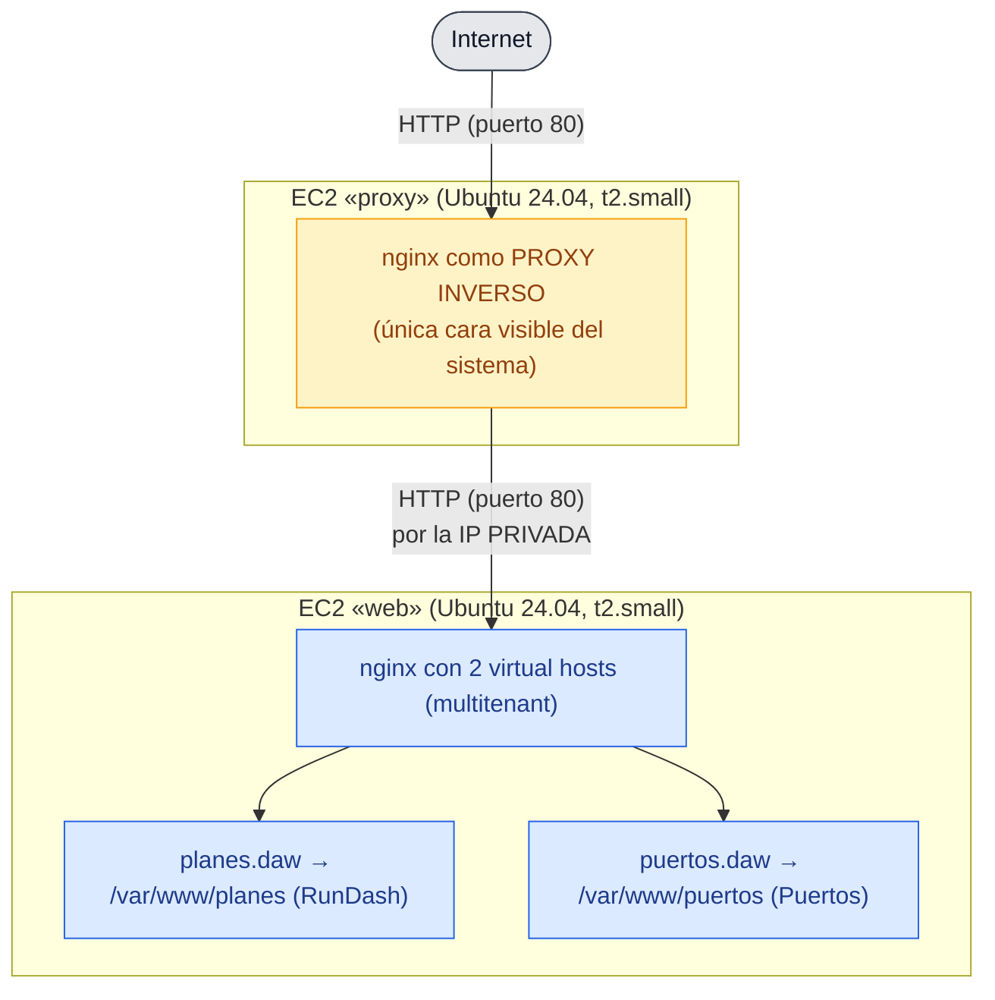

# Guía: proxy inverso con nginx 

En esta práctica vamos a montar **a mano** el siguiente escenario:
una instancia EC2 que hace de **proxy inverso** con nginx y que reenvía las
peticiones a una segunda instancia EC2 donde viven las aplicaciones web (las mismas
dos de la práctica 1.1: `planes.daw` y `puertos.daw`).

**Cómo leer esta guía:** después de cada comando o bloque de configuración hay un
apartado *«¿Qué significa?»* que explica línea a línea qué hace y por qué está ahí.
No copies nada sin haberlo leído antes: en el examen y en la vida real nadie
configura nada que no entiende.

## 1. El escenario que vamos a montar



El resultado final será:

- **Dos instancias EC2** con Ubuntu Server 24.04 LTS.
  - `rundash-proxy`: la puerta de entrada. Es la única que tiene el puerto 80
    abierto a Internet.
  - `rundash-web`: la que realmente tiene las aplicaciones. Solo habla con el proxy.
- **Dos security groups** distintos:
  - Uno para el proxy (SSH 22 y HTTP 80 desde cualquier sitio).
  - Otro para el backend (SSH 22 desde cualquier sitio y HTTP 80 **solo desde el
    security group del proxy**).
- **Un único par de claves** (.pem) compartido por ambas instancias.
- En el backend, el **escenario multitenant de la práctica 1.1**: las dos
  aplicaciones clonadas en `/var/www/planes` y `/var/www/puertos`, servidas como
  `planes.daw` y `puertos.daw`.
- nginx en el proxy reenviando todo lo que recibe al backend.

> **Importante:** el proxy no hace el multitenancy; solo reenvía peticiones. El
> reparto entre `planes.daw` y `puertos.daw` lo hace el **backend**, que sigue siendo
> el escenario multitenant de la práctica 1.1. Como el proxy conserva la cabecera
> `Host` (`proxy_set_header Host $host;`), al backend le llega el nombre original y
> puede elegir el virtual host correcto.

### 1.1. ¿Qué es un proxy inverso y por qué molestarse?

Un **proxy inverso** (*reverse proxy*) es un servidor que se coloca delante de uno
o más servidores reales (los *backends*) y recibe las peticiones de los clientes en
su nombre. El cliente cree que habla con el servidor final, pero en realidad habla
con el proxy, que es quien decide a qué backend pasarle la petición.

Es lo contrario de un proxy «normal» (proxy directo): el proxy directo trabaja para
el *cliente* (le ayuda a salir a Internet); el proxy inverso trabaja para el
*servidor* (le ayuda a recibir peticiones).

¿Por qué no exponer directamente el backend, como en la práctica 1.1? Porque un
proxy inverso aporta varias cosas que usaremos en las prácticas siguientes:

| Ventaja | Explicación |
|---|---|
| **Ocultar el backend** | El servidor con la aplicación no necesita IP pública ni puertos abiertos a Internet. Solo el proxy está expuesto. Menos superficie de ataque. |
| **Un único punto de entrada** | Puedes cambiar, añadir o quitar backends sin que los clientes se enteren: la dirección pública siempre es la del proxy. |
| **Balanceo de carga** | Si hay varios backends, el proxy puede repartir las peticiones entre ellos. |
| **Terminación TLS** | El proxy puede encargarse del HTTPS (cifrado) y hablar en HTTP simple con los backends. |
| **Caché, compresión, límites de velocidad…** | El proxy puede añadir muchas funciones sin tocar el backend. |

En esta práctica nos quedamos con lo esencial: **un proxy, un backend, reenvío
simple**. Aun así ya veremos las dos primeras ventajas (ocultar el backend y punto
único de entrada).

### 1.2. Conceptos nuevos que vamos a usar

| Concepto | Qué es |
|---|---|
| **Proxy inverso** | Servidor intermediario que recibe peticiones y las reenvía a uno o más backends. |
| **Backend** | El servidor que realmente tiene la aplicación y genera las respuestas. |
| **IP pública** | Dirección con la que una instancia es visible desde Internet. Es efímera (cambia al parar/arrancar). |
| **IP privada** | Dirección visible **solo dentro de la VPC** (la red virtual de AWS). No se puede llegar a ella desde Internet. |
| **VPC** (Virtual Private Cloud) | La red virtual aislada donde viven tus instancias. Las instancias de la misma VPC se ven entre sí por su IP privada. |
| **`proxy_pass`** | Directiva de nginx que le dice «reenvía esta petición a esta otra dirección». Es el corazón del proxy inverso. |

> Región de trabajo: **us-east-1 (N. Virginia)**. Como siempre, asegúrate de tenerla
> elegida en la esquina superior derecha de la consola antes de empezar.

## 2. Requisitos previos

- Cuenta de AWS con permisos para crear instancias EC2, security groups y key pairs.
  Vale la capa gratuita (free tier).
- Un cliente SSH instalado (Linux/macOS lo trae de serie; en Windows usa PowerShell
  o WSL, no PuTTY, para poder seguir los comandos tal cual).
- Navegador web y `curl` para comprobar el resultado.
- Haber hecho (o entender) la práctica 1.1: el backend se configura exactamente igual.

## 3. Crear el key pair y los dos security groups

A diferencia de la práctica 1.1, aquí conviene crear el key pair y los security
groups **antes** de lanzar las instancias, porque los vamos a compartir/reutilizar y
porque uno de los security groups referencia al otro.

### 3.1. Key pair (par de claves)

1. Consola EC2 → **Network & Security → Key Pairs → Create key pair**.
   - Name: `rundash-proxy-key`
   - Key pair type: **RSA**
   - Private key file format: **.pem**
2. Pulsa **Create key pair**. Se descarga `rundash-proxy-key.pem`.
   **Guárdalo bien: es la única vez que se puede descargar.**

Usamos **un solo key pair para las dos instancias**. Podríamos crear uno por
instancia, pero para un escenario de prácticas es más sencillo gestionar uno solo;
Terraform hace exactamente esto (un único `tls_private_key` para todo el escenario).

Recuerda restringir los permisos del fichero en tu máquina:

```bash
chmod 600 rundash-proxy-key.pem
```

(Se explicó en la práctica 1.1: SSH rechaza claves legibles por otros usuarios.)

### 3.2. Security group del proxy

3. **Network & Security → Security Groups → Create security group**:
   - Name: `rundash-proxy-sg`
   - Description: `SSH y HTTP para el proxy inverso`
   - VPC: deja la **VPC por defecto**.
   - Reglas de entrada (**Add rule**):

     | Tipo | Puerto | Origen      | Descripción |
     |------|--------|-------------|-------------|
     | SSH  | 22     | `0.0.0.0/0` | SSH         |
     | HTTP | 80     | `0.0.0.0/0` | HTTP        |

   - Deja la regla de salida por defecto (permite todo).
4. Pulsa **Create security group**.

Este grupo es idéntico al de la práctica 1.1: el proxy es la cara pública, así que
necesita SSH (para administrarlo) y HTTP (para recibir el tráfico web).

### 3.3. Security group del backend (la parte interesante)

5. **Create security group** otra vez:
   - Name: `rundash-proxy-backend-sg`
   - Description: `SSH desde cualquier sitio y HTTP solo desde el proxy`
   - VPC: la misma VPC por defecto.
   - Reglas de entrada:

     | Tipo | Puerto | Origen                          | Descripción              |
     |------|--------|---------------------------------|--------------------------|
     | SSH  | 22     | `0.0.0.0/0`                     | SSH                      |
     | HTTP | 80     | `rundash-proxy-sg` (el grupo)   | HTTP solo desde el proxy |

   Para la segunda regla, en **Source** empieza a escribir `rundash-proxy-sg` y
   selecciónalo cuando aparezca: verás que el origen se escribe como
   `sg-xxxxxxxx` (el identificador del security group), no como una IP.

   - Deja la regla de salida por defecto.
6. Pulsa **Create security group**.

**¿Qué significa que el origen sea otro security group?**

Hasta ahora habíamos puesto como origen un rango de IPs (`0.0.0.0/0`). Pero AWS
también permite poner **otro security group** como origen. La regla entonces
significa: «acepta tráfico en el puerto 80 que provenga de cualquier instancia que
tenga asignado el security group `rundash-proxy-sg`».

Esto es exactamente lo que queremos:

- El proxy (que tiene `rundash-proxy-sg`) puede hablar con el backend por el
  puerto 80. ✅
- Cualquier otra cosa de Internet que intente llegar al backend por el puerto 80
  queda bloqueada, porque no viene de una instancia con ese grupo. ✅

Así el backend **no necesita** (y de hecho no tiene) el puerto 80 abierto al mundo.
Es la materialización de la ventaja «ocultar el backend». .

> Nota sobre el SSH del backend: lo dejamos abierto a `0.0.0.0/0` para poder
> administrarlo directamente desde tu máquina.
> En un entorno real más duro se restringiría el SSH al backend para que solo se
> pudiera entrar a través del proxy (patrón *bastión*), pero eso complica la
> práctica y no aporta nada nuevo aquí.

## 4. Lanzar las dos instancias

Lanza primero el backend y luego el proxy (el orden no importa técnicamente, pero
así tienes la IP privada del backend a mano antes de configurar el proxy).

### 4.1. Instancia backend (`rundash-web`)

1. **Launch instance**:
   - **Name**: `rundash-web`
   - **AMI**: Ubuntu Server 24.04 LTS (x86_64), propietario `099720109477`.
   - **Instance type**: `t2.small`.
   - **Key pair**: `rundash-proxy-key` (el que creaste en 3.1).
   - **Network settings → Edit**: en **Firewall (security groups)** elige
     **Select existing security group** y marca `rundash-proxy-backend-sg`.
   - **Configure storage**: 8 GiB gp3.
   - **Advanced details → User data**: pega esto:

     ```yaml
     #cloud-config
     hostname: rundash-web
     package_update: true
     packages:
       - python3
       - python3-apt
     ```

     Es el mismo user data de la práctica 1.1, cambiando el hostname a
     `rundash-web`. (Qué hace cada línea está explicado allí; en resumen: fija el
     nombre de la máquina, refresca `apt` e instala lo que Ansible necesita.)
2. **Launch instance**.

### 4.2. Instancia proxy (`rundash-proxy`)

3. **Launch instance** otra vez:
   - **Name**: `rundash-proxy`
   - **AMI**: Ubuntu Server 24.04 LTS (x86_64).
   - **Instance type**: `t2.small`.
   - **Key pair**: `rundash-proxy-key`.
   - **Network settings → Edit**: selecciona `rundash-proxy-sg`.
   - **Configure storage**: 8 GiB gp3.
   - **Advanced details → User data**:

     ```yaml
     #cloud-config
     hostname: rundash-proxy
     package_update: true
     packages:
       - python3
       - python3-apt
     ```
4. **Launch instance**.

### 4.3. Anotar las direcciones

Cuando ambas estén `running` y con los *Status checks* en verde, ve a **Instances**
y anota:

- La **Public IPv4 address** del proxy → la llamaremos `<IP_PROXY>`. Es la única
  dirección pública que usará el cliente.
- La **Private IPv4 address** del backend → la llamaremos `<IP_PRIV_WEB>`. La
  verás en la columna *Private IPv4 address* (quizá tengas que añadirla a las
  columnas visibles con el icono de engranaje). Suele ser algo como `172.31.x.x`.

**¿Por qué el proxy usará la IP privada del backend y no la pública?** Porque la IP
privada es estable dentro de la VPC y el tráfico entre instancias de la misma VPC no
sale a Internet (es más rápido, gratis y no depende de que el backend tenga IP
pública). Además, como hemos cerrado el puerto 80 del backend al mundo, *solo*
llegando por la red interna se puede hablar con él.

## 5. Configurar el backend (igual que la práctica 1.1)

El backend se configura **exactamente igual** que la instancia de la práctica 1.1:
instalar nginx y git, clonar las **dos** aplicaciones y servir los dos sitios como
virtual hosts (`planes.daw` y `puertos.daw`). Lo repetimos aquí para que la práctica
sea autocontenida.

Conecta por SSH al backend usando su **IP pública** (sí, el backend tiene IP
pública; lo que está cerrado es su puerto 80, no el 22):

```bash
ssh -i rundash-proxy-key.pem ubuntu@<IP_PUB_WEB>
```

Todos los comandos siguientes se ejecutan **dentro de esa sesión SSH**, con `sudo`
cuando haga falta (se explicó en la práctica 1.1).

### 5.1. Comprobar cloud-init e instalar paquetes

```bash
cloud-init status --wait
```

Espera a que la configuración inicial termine (debe acabar diciendo `done`). Así
evitamos pelearnos con `apt` mientras cloud-init sigue instalando cosas.

```bash
sudo apt update
sudo apt install -y nginx git
```

- `nginx`: el servidor web que servirá los dos sitios en el backend.
- `git`: para clonar los repositorios.

> Si `apt` se queja de un lock (`Could not get lock /var/lib/dpkg/lock-frontend`),
> cloud-init aún está trabajando: espera un minuto y reintenta.

### 5.2. Clonar las dos aplicaciones

Cada inquilino tiene su propio directorio dentro de `/var/www`:

```bash
sudo git clone https://github.com/raul-profesor/rundash.git /var/www/planes
sudo git clone https://github.com/raul-profesor/puertos-tour.git /var/www/puertos
```

`/var/www/planes` contendrá RunDash (responderá a `planes.daw`) y `/var/www/puertos`
Puertos Míticos (responderá a `puertos.daw`). (El detalle de estos clones está en la
guía de la práctica 1.1.)

### 5.3. Configurar y activar los dos sitios

Crea un virtual host por tenant. Primero `planes.daw`:

```bash
sudo nano /etc/nginx/sites-available/planes.daw
```

```nginx
server {
    listen 80;
    listen [::]:80;
    server_name planes.daw;

    root /var/www/planes;
    index index.html;

    location / {
        try_files $uri $uri/index.html $uri/ =404;
    }
}
```

Y luego `puertos.daw`:

```bash
sudo nano /etc/nginx/sites-available/puertos.daw
```

```nginx
server {
    listen 80;
    listen [::]:80;
    server_name puertos.daw;

    root /var/www/puertos;
    index index.html;

    location / {
        try_files $uri $uri/index.html $uri/ =404;
    }
}
```

El significado de cada línea está en la guía de la práctica 1.1. Lo importante aquí es
que el `server_name` de cada bloque es el nombre de su sitio (`planes.daw` /
`puertos.daw`), para que el backend elija el virtual host correcto a partir de la
cabecera `Host` que le reenvía el proxy.

Activa ambos sitios, desactiva el de ejemplo y valida:

```bash
sudo ln -s /etc/nginx/sites-available/planes.daw /etc/nginx/sites-enabled/planes.daw
sudo ln -s /etc/nginx/sites-available/puertos.daw /etc/nginx/sites-enabled/puertos.daw
sudo rm /etc/nginx/sites-enabled/default
sudo nginx -t
sudo systemctl reload nginx
sudo systemctl enable nginx
```

Comprueba que el backend sirve **los dos** sitios **localmente**, forzando la cabecera
`Host` (los nombres aún no resuelven hacia el backend):

```bash
curl -s -H "Host: planes.daw"  http://localhost/ | head -5
curl -s -H "Host: puertos.daw" http://localhost/ | head -5
```

Debes ver el HTML de RunDash con el primer comando y el de Puertos Míticos con el
segundo. Este paso es clave: **verifica el backend antes de culpar al proxy**.

## 6. Configurar el proxy inverso

Sal de la sesión del backend (`exit`) y conecta al proxy por su IP pública:

```bash
ssh -i rundash-proxy-key.pem ubuntu@<IP_PROXY>
```

### 6.1. Instalar nginx

```bash
cloud-init status --wait
sudo apt update
sudo apt install -y nginx
```

En el proxy **solo instalamos nginx**: no necesitamos git (no vamos a clonar nada)
porque el proxy no sirve contenido propio, solo reenvía peticiones.

### 6.2. Configurar el proxy inverso

```bash
sudo nano /etc/nginx/sites-available/rundash-proxy
```

Pega este contenido, sustituyendo `<IP_PRIV_WEB>` por la IP privada del backend que
anotaste en 4.3:

```nginx
server {
    listen 80;
    listen [::]:80;
    server_name _;

    location / {
        proxy_pass http://<IP_PRIV_WEB>;
        proxy_set_header Host $host;
        proxy_set_header X-Real-IP $remote_addr;
        proxy_set_header X-Forwarded-For $proxy_add_x_forwarded_for;
        proxy_set_header X-Forwarded-Proto $scheme;
    }
}
```

**¿Qué significa cada línea?**

| Línea | Significado |
|---|---|
| `server { ... }` | Un *virtual host* de nginx, como en la práctica 1.1. |
| `listen 80;` / `listen [::]:80;` | El proxy atiende peticiones HTTP (IPv4 e IPv6) en el puerto 80. Es el puerto que el security group del proxy tiene abierto al mundo. |
| `server_name _;` | Igual que antes: sin dominio, este `server` es el cajón de sastre del puerto 80. |
| `location / { ... }` | Regla para todas las rutas. |
| `proxy_pass http://<IP_PRIV_WEB>;` | **El corazón del proxy inverso.** Le dice a nginx: «todo lo que llegue a esta `location`, en vez de servirlo tú de un directorio local, **reenvíalo** a `http://<IP_PRIV_WEB>` (el backend)». nginx abre una conexión HTTP al backend, le pasa la petición del cliente, recibe su respuesta y se la devuelve al cliente. Observa que **no** hay barra final ni ruta: reenvía todo tal cual. |
| `proxy_set_header Host $host;` | Al reenviar, nginx reescribe las cabeceras HTTP. Esta línea conserva la cabecera `Host` original del cliente (`$host`), para que el backend sepa a qué sitio llamaban. |
| `proxy_set_header X-Real-IP $remote_addr;` | Añade una cabecera con la IP real del cliente (`$remote_addr`). Sin ella, el backend solo vería la IP del proxy y no sabría quién es el cliente de verdad. |
| `proxy_set_header X-Forwarded-For $proxy_add_x_forwarded_for;` | Similar a la anterior pero con la lista completa de saltos. `$proxy_add_x_forwarded_for` toma la cabecera existente (si la hay) y le añade la IP del cliente. Es la convención estándar para proxies. |
| `proxy_set_header X-Forwarded-Proto $scheme;` | Informa al backend de si el cliente llegó por `http` o `https` (`$scheme`). Útil cuando el backend necesita saber el protocolo original. |

> **¿Por qué `proxy_pass` sin barra final?** Con `proxy_pass http://IP;` (sin `/`
> detrás), nginx pasa la URI del cliente **sin modificar**. Si escribiéramos
> `proxy_pass http://IP/;` (con `/`), nginx sustituiría la parte de la URL que
> coincide con la `location`. Para «reenviar todo tal cual», la forma sin barra es
> la correcta y la más sencilla.

Guarda (`Ctrl+O`, `Enter`, `Ctrl+X`).

Activa el sitio, desactiva el de ejemplo y valida:

```bash
sudo ln -s /etc/nginx/sites-available/rundash-proxy /etc/nginx/sites-enabled/rundash-proxy
sudo rm /etc/nginx/sites-enabled/default
sudo nginx -t
sudo systemctl reload nginx
sudo systemctl enable nginx
```

`sudo nginx -t` debe decir `syntax is ok`. Si falla, casi seguro que es un error de
escritura en la IP privada o una llave sin cerrar: te dirá el fichero y la línea.

## 7. Verificación final

### 7.1. Resolver los dominios hacia el proxy

Como en la práctica 1.1, tu máquina local necesita resolver `planes.daw` y
`puertos.daw`. La diferencia es que ahora **apuntan al proxy** (su IP pública), no al
backend: el cliente habla con el proxy y este reenvía al backend. Añade en el
`/etc/hosts` de tu máquina:

```text
<IP_PROXY>  planes.daw puertos.daw
```

(Recuerda: `/etc/hosts` se edita con permisos de administrador; en Linux/macOS `sudo
nano /etc/hosts`, en Windows el Bloc de notas como administrador en
`C:\Windows\System32\drivers\etc\hosts`.)

### 7.2. Con curl y en el navegador

Desde tu máquina local:

```bash
curl -I http://planes.daw
curl -I http://puertos.daw
```

Ambos deben dar `HTTP/1.1 200 OK` y `Server: nginx`. **Estás hablando con el proxy**,
que ha ido a buscar la respuesta al backend y te la ha traído. El backend, por su
parte, ha elegido el sitio por `server_name` según la cabecera `Host` que le pasó el
proxy: RunDash en `planes.daw` y Puertos Míticos en `puertos.daw`.

Abre en el navegador `http://planes.daw` y `http://puertos.daw`: verás dos webs
distintas aunque todo el contenido lo genera el backend y tú solo ves la dirección del
proxy.

### 7.3. Demostrar que el backend está oculto

Esta es la comprobación estrella de la práctica. Intenta acceder **directamente** al
backend por su IP pública, por el puerto 80:

```bash
curl -I --max-time 10 http://<IP_PUB_WEB>
```

El comando debe **agotar el tiempo de espera** (timeout) o fallar. ¿Por qué? Porque
el security group del backend no tiene ninguna regla que permita el puerto 80 desde
Internet: solo lo permite desde el security group del proxy. Tu máquina no es el
proxy, así que el paquete se descarta.

> Ojo: el backend **sí** responde por SSH (puerto 22), porque esa regla sí está
> abierta a `0.0.0.0/0`. Lo que está cerrado es solo el tráfico web.

### 7.4. Ver el tráfico desde dentro

Si quieres ver el reenvío «por dentro», conecta al proxy y mira sus logs mientras
recargas la página en el navegador:

```bash
sudo tail -f /var/log/nginx/access.log
```

Verás una línea por petición. En el log del **proxy** aparece la IP del cliente. Si
haces lo mismo en el backend (`sudo tail -f /var/log/nginx/access.log` dentro del
backend), verás que ahí todas las peticiones vienen de la **IP privada del proxy**:
es el proxy quien le habla, no el cliente directamente.

## 8. Limpieza (importante: evita costes)

Cuando termines, deshaz el escenario:

1. **Instances**: selecciona `rundash-proxy` y `rundash-web` → **Instance state →
   Terminate instance**. Confirma.
2. **Security Groups**: borra `rundash-proxy-sg` y `rundash-proxy-backend-sg`.
   *Nota*: AWS no te dejará borrar un security group mientras otro lo referencie.
   Como `rundash-proxy-backend-sg` referencia a `rundash-proxy-sg` en su regla de HTTP,
   puede que tengas que borrar primero el backend (o la regla) si te da error
   `DependencyViolation`. Al terminar las instancias normalmente se puede borrar
   cualquiera de los dos.
3. **Key Pairs**: opcionalmente borra `rundash-proxy-key`.
4. Borra `rundash-proxy-key.pem` de tu máquina si ya no lo vas a usar.

> Dos instancias `t2.small` encendidas generan el doble de cargo por hora que una.
> No las dejes corriendo entre clases.

## 9. Solución de problemas

| Síntoma | Causa probable | Solución |
|---|---|---|
| `curl http://<IP_PROXY>` devuelve `502 Bad Gateway` | El proxy no alcanza al backend: IP privada mal escrita, backend apagado, o la regla HTTP del backend no permite al proxy | Revisa la IP privada en `proxy_pass`, que el backend esté `running` y que `rundash-proxy-backend-sg` tenga la regla HTTP con origen `rundash-proxy-sg` |
| `curl http://<IP_PROXY>` devuelve `504 Gateway Timeout` | El backend no responde en el puerto 80 (nginx caído en el backend) | Entra al backend y `sudo systemctl status nginx`; prueba `curl http://localhost/` allí |
| El navegador muestra «Welcome to nginx» en el proxy | El sitio `default` sigue activo en el proxy | `sudo rm /etc/nginx/sites-enabled/default && sudo systemctl reload nginx` |
| `curl http://<IP_PUB_WEB>` **sí** responde (y no debería) | La regla HTTP del backend está abierta a `0.0.0.0/0` en vez de al security group del proxy | Corrige el origen de la regla HTTP de `rundash-proxy-backend-sg` para que sea el security group del proxy |
| `nginx -t` falla en el proxy | Error de sintaxis: IP privada mal puesta, llave sin cerrar, punto y coma olvidado | Lee el fichero y la línea que indica el error y corrígelo |
| El proxy responde pero el contenido no es RunDash | El backend sirve el sitio equivocado o el `root` del backend apunta mal | Verifica en el backend `curl http://localhost/` y el `root` de su nginx |
| `ssh` al backend falla con timeout | El security group del backend no tiene el puerto 22 abierto, o estás usando la IP equivocada | Revisa la regla SSH de `rundash-proxy-backend-sg` y la IP pública actual del backend |

