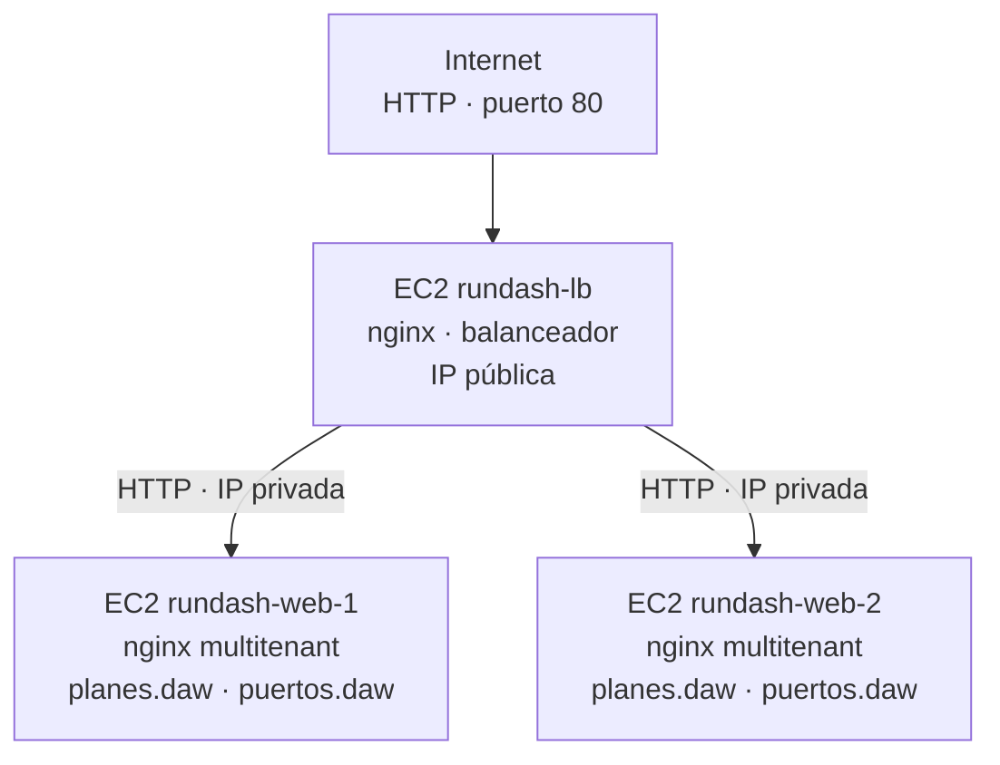

# Guía: balanceo de carga con nginx

En esta práctica vamos a montar **a mano** una instancia EC2 que hace de
**balanceador de carga** con nginx y reparte las peticiones entre **dos** instancias
EC2, cada una con las dos aplicaciones web (las mismas de la práctica 1.1:
`planes.daw` y `puertos.daw`). Es la evolución natural de la práctica 1.2: allí había
un proxy y un solo backend; aquí el proxy reparte entre varios.

**Cómo leer esta guía:** después de cada comando o bloque de configuración hay un
apartado *«¿Qué significa?»* que explica línea a línea qué hace y por qué está ahí.
No copies nada sin haberlo leído antes.

## 1. El escenario que vamos a montar



El resultado final será:

- **Tres instancias EC2** con Ubuntu Server 24.04 LTS:
  - `rundash-lb`: el balanceador, única máquina con el puerto 80 abierto a Internet.
  - `rundash-web-1` y `rundash-web-2`: dos backends idénticos con las dos aplicaciones.
- **Dos security groups**:
  - Uno para el balanceador (SSH 22 y HTTP 80 desde cualquier sitio).
  - Uno para los backends (SSH 22 desde cualquier sitio y HTTP 80 **solo desde el
    security group del balanceador**).
- **Un único par de claves** (.pem) compartido por las tres instancias.
- El **escenario multitenant de la práctica 1.1** (las dos aplicaciones en
  `/var/www/planes` y `/var/www/puertos`, servidas como `planes.daw` y `puertos.daw`)
  **en cada backend**.
- nginx en el balanceador repartiendo peticiones entre los dos backends.

> El balanceador reparte por máquina (backend 1 o backend 2) y conserva la cabecera
> `Host`; el backend, con el nombre que recibe, elige el sitio (`planes.daw` o
> `puertos.daw`) mediante `server_name`. Así conviven dos repartos: por máquina en el
> balanceador y por nombre en cada backend.

### 1.1. ¿Qué es el balanceo de carga y para qué sirve?

Un **balanceador de carga** (*load balancer*) es un proxy inverso que, en vez de
reenviar todo a un único backend, **reparte** las peticiones entre varios. Las
ventajas principales:

| Ventaja | Explicación |
|---|---|
| **Alta disponibilidad** | Si un backend se cae, el balanceador deja de enviarle tráfico y sigue sirviendo con los demás. El usuario no nota la caída. |
| **Mayor capacidad** | La carga se reparte: con N backends puedes atender (aproximadamente) N veces más peticiones que con uno solo. |
| **Escalabilidad** | Para absorber más tráfico basta con añadir backends al balanceador, sin cambiar nada de cara al cliente. |
| **Mantenimiento sin cortes** | Puedes sacar un backend, actualizarlo y volverlo a meter, mientras los demás siguen sirviendo. |

En la práctica 1.2 ya teníamos un proxy inverso con un backend. La novedad aquí es
el **reparto**: el balanceador decide, petición a petición, a qué backend se la pasa.

### 1.2. ¿Cómo reparte nginx? El método *round-robin*

nginx usa por defecto el algoritmo **round-robin** (por turnos): atiende la primera
petición con el backend 1, la segunda con el backend 2, la tercera otra vez con el 1,
y así sucesivamente. Es simple, justo y suficiente para esta práctica.

Existen otros algoritmos que nginx soporta y que conviene conocer de nombre:

| Algoritmo | Directiva | Comportamiento |
|---|---|---|
| Round-robin | *(por defecto)* | Por turnos, uno tras otro. |
| Menos conexiones | `least_conn;` | Envía la petición al backend con menos conexiones activas. Útil si las peticiones duran tiempos muy distintos. |
| IP hash | `ip_hash;` | Elige el backend en función de la IP del cliente, de modo que un mismo cliente va siempre al mismo backend (útil para sesiones). |

Nosotros usaremos round-robin (no hay que escribir nada especial: es el
comportamiento por defecto de un `upstream`).

### 1.3. ¿Cómo comprobamos que de verdad reparte?

Si ambos backends sirven exactamente el mismo contenido, las respuestas serán
idénticas y no veremos el reparto «a ojo». Por eso vamos a hacer que cada backend
**se identifique** en una cabecera HTTP de respuesta.

En el nginx de cada backend añadiremos:

```nginx
add_header X-Served-By $hostname always;
```

Esto añade a cada respuesta una cabecera `X-Served-By` con el nombre de la máquina
(`rundash-web-1` o `rundash-web-2`). Como el balanceador transmite las cabeceras del
backend al cliente, desde fuera podremos ver quién ha respondido cada petición.
Pedimos uno de los dos sitios (que resolverá hacia el balanceador; ver apartado 7):

```bash
curl -sI http://planes.daw | grep X-Served-By
```

Si repetimos el comando varias veces, el valor debe **alternar** entre
`rundash-web-1` y `rundash-web-2`. Esa es la prueba de que el balanceo funciona.

> `$hostname` es una variable interna de nginx con el nombre de la máquina donde
> corre. `add_header` añade una cabecera a la respuesta; la palabra `always` hace
> que la añada también en respuestas de error (404, 500…), no solo en las de éxito.

### 1.4. Conceptos nuevos

| Concepto | Qué es |
|---|---|
| **Balanceador de carga** | Proxy inverso que reparte peticiones entre varios backends. |
| **`upstream`** | Bloque de nginx que define un «grupo» de backends entre los que repartir. Tiene un nombre y una lista de `server`. |
| **Round-robin** | Algoritmo de reparto por turnos (el por defecto de nginx). |
| **`add_header`** | Directiva que añade una cabecera HTTP a las respuestas de nginx. |

> Región de trabajo: **us-east-1 (N. Virginia)**, como siempre.

## 2. Requisitos previos

- Cuenta de AWS con permisos para crear instancias EC2, security groups y key pairs.
  Vale la capa gratuita (free tier).
- Cliente SSH y `curl` instalados.
- Haber hecho (o entender) las prácticas 1.1 y 1.2: los backends se configuran como
  en 1.1 y el balanceador es un proxy inverso como el de 1.2, pero con `upstream`.

## 3. Crear el key pair y los dos security groups

Igual que en la práctica 1.2, creamos primero el key pair y los security groups,
porque uno de ellos referencia al otro.

### 3.1. Key pair

1. **Network & Security → Key Pairs → Create key pair**:
   - Name: `rundash-lb-key`, tipo **RSA**, formato **.pem**.
2. Descarga `rundash-lb-key.pem` y protégelo:

```bash
chmod 600 rundash-lb-key.pem
```

Un solo key pair para las tres instancias.

### 3.2. Security group del balanceador

3. **Create security group**:
   - Name: `rundash-lb-sg`
   - Description: `SSH y HTTP para el balanceador de carga`
   - VPC por defecto. Reglas de entrada:

     | Tipo | Puerto | Origen      | Descripción |
     |------|--------|-------------|-------------|
     | SSH  | 22     | `0.0.0.0/0` | SSH         |
     | HTTP | 80     | `0.0.0.0/0` | HTTP        |

### 3.3. Security group de los backends

4. **Create security group**:
   - Name: `rundash-lb-backend-sg`
   - Description: `SSH desde cualquier sitio y HTTP solo desde el balanceador`
   - VPC por defecto. Reglas de entrada:

     | Tipo | Puerto | Origen                        | Descripción                  |
     |------|--------|-------------------------------|------------------------------|
     | SSH  | 22     | `0.0.0.0/0`                   | SSH                          |
     | HTTP | 80     | `rundash-lb-sg` (el grupo)    | HTTP solo desde el balanceador |

   En la regla HTTP, en **Source** escribe `rundash-lb-sg` y selecciónalo: el origen
   quedará como `sg-xxxxxxxx`.

**¿Por qué?** Exactamente la misma razón que en 1.2: los backends no deben recibir
tráfico web directamente de Internet, solo del balanceador. Así, aunque tengan IP
pública para poder administrarlos por SSH, su puerto 80 queda protegido.

## 4. Lanzar las tres instancias

Lanza primero los dos backends (para tener sus IPs privadas) y luego el balanceador.

### 4.1. Backend 1 (`rundash-web-1`)

1. **Launch instance**:
   - **Name**: `rundash-web-1`
   - **AMI**: Ubuntu Server 24.04 LTS (x86_64).
   - **Instance type**: `t2.small`.
   - **Key pair**: `rundash-lb-key`.
   - **Network settings → Edit**: security group `rundash-lb-backend-sg`.
   - **Configure storage**: 8 GiB gp3.
   - **Advanced details → User data**:

     ```yaml
     #cloud-config
     hostname: rundash-web-1
     package_update: true
     packages:
       - python3
       - python3-apt
     ```
2. **Launch instance**.

### 4.2. Backend 2 (`rundash-web-2`)

3. Repite el lanzamiento anterior, pero con:
   - **Name**: `rundash-web-2`
   - **User data**:

     ```yaml
     #cloud-config
     hostname: rundash-web-2
     package_update: true
     packages:
       - python3
       - python3-apt
     ```

> Los dos backends son idénticos salvo el nombre. En un despliegue real esto se
> haría con una plantilla o un bucle; a mano, simplemente se lanzan dos veces.

### 4.3. Balanceador (`rundash-lb`)

4. **Launch instance**:
   - **Name**: `rundash-lb`
   - **AMI**: Ubuntu Server 24.04 LTS (x86_64).
   - **Instance type**: `t2.small`.
   - **Key pair**: `rundash-lb-key`.
   - **Network settings → Edit**: security group `rundash-lb-sg`.
   - **Configure storage**: 8 GiB gp3.
   - **Advanced details → User data**:

     ```yaml
     #cloud-config
     hostname: rundash-lb
     package_update: true
     packages:
       - python3
       - python3-apt
     ```
5. **Launch instance**.

### 4.4. Anotar las direcciones

Cuando las tres estén `running` y con los *Status checks* en verde, anota:

- **Public IPv4 address** del balanceador → `<IP_LB>`.
- **Private IPv4 address** de `rundash-web-1` → `<IP_PRIV_WEB1>`.
- **Private IPv4 address** de `rundash-web-2` → `<IP_PRIV_WEB2>`.

Las IPs privadas suelen ser `172.31.x.x`. El balanceador usará estas dos últimas en
su bloque `upstream`.

## 5. Configurar los dos backends

Cada backend se configura igual que en la práctica 1.1, **más** la cabecera
`X-Served-By` para poder observar el balanceo. Hazlo en los dos.

Conecta al backend 1 por su IP pública:

```bash
ssh -i rundash-lb-key.pem ubuntu@<IP_PUB_WEB1>
```

### 5.1. Comprobar cloud-init e instalar paquetes

```bash
cloud-init status --wait
sudo apt update
sudo apt install -y nginx git
```

### 5.2. Clonar las dos aplicaciones

Cada backend reproduce el escenario multitenant de la práctica 1.1: dos aplicaciones,
cada una en su propio directorio de `/var/www`:

```bash
sudo git clone https://github.com/raul-profesor/rundash.git /var/www/planes
sudo git clone https://github.com/raul-profesor/puertos-tour.git /var/www/puertos
```

`/var/www/planes` contendrá RunDash (responderá a `planes.daw`) y `/var/www/puertos`
Puertos Míticos (`puertos.daw`).

### 5.3. Configurar y activar los dos sitios

Crea un virtual host por tenant. Son los mismos de la práctica 1.1, **más** la línea
`add_header X-Served-By $hostname always;` (explicada en 1.3 de esta guía) para poder
observar el balanceo. Primero `planes.daw`:

```bash
sudo nano /etc/nginx/sites-available/planes.daw
```

```nginx
server {
    listen 80;
    listen [::]:80;
    server_name planes.daw;

    root /var/www/planes;
    index index.html;

    add_header X-Served-By $hostname always;

    location / {
        try_files $uri $uri/index.html $uri/ =404;
    }
}
```

Y luego `puertos.daw`:

```bash
sudo nano /etc/nginx/sites-available/puertos.daw
```

```nginx
server {
    listen 80;
    listen [::]:80;
    server_name puertos.daw;

    root /var/www/puertos;
    index index.html;

    add_header X-Served-By $hostname always;

    location / {
        try_files $uri $uri/index.html $uri/ =404;
    }
}
```

Guarda ambos (`Ctrl+O`, `Enter`, `Ctrl+X`). El `server_name` de cada bloque es el
nombre de su sitio: el backend elige el virtual host correcto a partir de la cabecera
`Host` que le reenvía el balanceador.

Activa ambos sitios, desactiva el de ejemplo y valida:

```bash
sudo ln -s /etc/nginx/sites-available/planes.daw /etc/nginx/sites-enabled/planes.daw
sudo ln -s /etc/nginx/sites-available/puertos.daw /etc/nginx/sites-enabled/puertos.daw
sudo rm /etc/nginx/sites-enabled/default
sudo nginx -t
sudo systemctl reload nginx
sudo systemctl enable nginx
```

Comprueba localmente, forzando la cabecera `Host`, que el backend sirve el sitio y que
la cabecera identificadora sale:

```bash
curl -sI -H "Host: planes.daw" http://localhost/ | grep -i x-served-by
```

Debe imprimir `X-Served-By: rundash-web-1`. Si sale, el backend 1 está listo.

Sal (`exit`) y **repite todo el apartado 5 en el backend 2** (`rundash-web-2`),
conectando a `<IP_PUB_WEB2>`. Al final, `curl -sI -H "Host: planes.daw"
http://localhost/ | grep -i x-served-by` allí debe dar `X-Served-By: rundash-web-2`.

## 6. Configurar el balanceador

Conecta al balanceador por su IP pública:

```bash
ssh -i rundash-lb-key.pem ubuntu@<IP_LB>
```

### 6.1. Instalar nginx

```bash
cloud-init status --wait
sudo apt update
sudo apt install -y nginx
```

En el balanceador solo instalamos nginx: no clonamos la aplicación, porque no sirve
contenido propio, solo reparte peticiones.

### 6.2. Configurar el balanceador

```bash
sudo nano /etc/nginx/sites-available/rundash-lb
```

Pega este contenido, sustituyendo `<IP_PRIV_WEB1>` y `<IP_PRIV_WEB2>` por las IPs
privadas que anotaste en 4.4:

```nginx
upstream rundash_backend {
    server <IP_PRIV_WEB1>:80 max_fails=2 fail_timeout=30s;
    server <IP_PRIV_WEB2>:80 max_fails=2 fail_timeout=30s;
}

server {
    listen 80;
    listen [::]:80;
    server_name _;

    location / {
        proxy_pass http://rundash_backend;
        proxy_connect_timeout 3s;
        proxy_send_timeout 10s;
        proxy_read_timeout 10s;
        proxy_next_upstream error timeout http_502 http_503 http_504;
        proxy_set_header Host $host;
        proxy_set_header X-Real-IP $remote_addr;
        proxy_set_header X-Forwarded-For $proxy_add_x_forwarded_for;
        proxy_set_header X-Forwarded-Proto $scheme;
    }
}
```

**¿Qué significa cada parte?**

| Parte | Significado |
|---|---|
| `upstream rundash_backend { ... }` | Define un **grupo de backends** llamado `rundash_backend`. Es la novedad respecto a la práctica 1.2: en vez de apuntar a una sola IP, `proxy_pass` apuntará a este nombre y nginx repartirá entre sus miembros. |
| `server <IP_PRIV_WEB1>:80 max_fails=2 fail_timeout=30s;` | Un miembro del grupo: la IP privada del backend 1 y su puerto. `max_fails=2` y `fail_timeout=30s` son la detección de caídas: si el backend acumula 2 fallos en 30 s, nginx lo declara caído y deja de enviarle peticiones durante 30 s (pasados los cuales vuelve a probarlo). |
| `server <IP_PRIV_WEB2>:80 ...;` | El segundo miembro, con los mismos parámetros. |
| `server { ... }` | El *virtual host* del balanceador, como en 1.2. |
| `listen 80;` / `listen [::]:80;` | Atiende HTTP en el puerto 80. |
| `server_name _;` | Cajón de sastre del puerto 80 (no hay dominio). |
| `location / { ... }` | Regla para todas las rutas. |
| `proxy_pass http://rundash_backend;` | **La clave.** En vez de `http://<IP>` (una máquina concreta), apuntamos al **nombre del upstream**. nginx elegirá, por round-robin, uno de los dos backends para cada petición. |
| `proxy_connect_timeout 3s;` | Cuánto espera nginx para **establecer** la conexión con un backend. Por defecto son 60 s: si un nodo está caído (p. ej. la instancia parada), cada petición que caiga en él se quedaría colgada un minuto. Con 3 s se detecta rápido y se reintenta en el otro. |
| `proxy_send_timeout 10s;` / `proxy_read_timeout 10s;` | Cuánto espera entre operaciones de envío/lectura con el backend. Si un nodo se queda «colgado» a mitad de respuesta, no esperamos indefinidamente. |
| `proxy_next_upstream error timeout http_502 http_503 http_504;` | En qué casos nginx **reintenta** la petición en el siguiente backend: errores de conexión, timeouts y respuestas 502/503/504. Es lo que hace que una caída se resuelva sola sin que el cliente la note. |
| `proxy_set_header ...` | Las mismas cuatro cabeceras que en 1.2: conservan el `Host` original e informan al backend de la IP y protocolo reales del cliente. |

> Observa que el `upstream` se define **fuera** del bloque `server` (al mismo nivel).
> Es una definición global de grupo que luego cualquier `server` puede usar por su
> nombre.

> **Sobre la detección de caídas:** nginx open source solo hace *health checks
> pasivos*: no sondea los backends, se entera de que uno está caído cuando una
> petición real falla. Por eso son importantes `proxy_connect_timeout` (detectar
> rápido) y `max_fails`/`fail_timeout` (excluirlo de la rotación un tiempo). Los
> *health checks activos* (sondear cada X segundos aunque no haya tráfico) solo
> existen en nginx Plus o con módulos de terceros.

Guarda (`Ctrl+O`, `Enter`, `Ctrl+X`).

Activa el sitio, desactiva el de ejemplo y valida:

```bash
sudo ln -s /etc/nginx/sites-available/rundash-lb /etc/nginx/sites-enabled/rundash-lb
sudo rm /etc/nginx/sites-enabled/default
sudo nginx -t
sudo systemctl reload nginx
sudo systemctl enable nginx
```

`nginx -t` debe decir `syntax is ok`. Si falla, revisa que las dos IPs privadas estén
bien escritas y que el nombre del `upstream` coincida exactamente con el de
`proxy_pass` (aquí, `rundash_backend`).

## 7. Verificación final

### 7.1. Resolver los dominios hacia el balanceador

Como en las prácticas anteriores, las peticiones a `planes.daw` y `puertos.daw`
tienen que llegar al balanceador (su IP pública), no directamente a un backend.

Si tienes permisos para editar `/etc/hosts`, añade esta línea en tu máquina:

```text
<IP_LB>  planes.daw puertos.daw
```

(Recuerda: `/etc/hosts` se edita con permisos de administrador; en Linux/macOS `sudo
nano /etc/hosts`, en Windows el Bloc de notas como administrador en
`C:\Windows\System32\drivers\etc\hosts`.)

Si no tienes esos permisos, puedes hacer las comprobaciones con Docker. La opción
`--add-host` crea las entradas solo dentro del contenedor y no modifica la
configuración de tu máquina. Necesitas tener Docker instalado y permiso para usarlo;
sustituye `<IP_LB>` por la IP pública del balanceador. Esta opción sirve para las
pruebas con `curl`; para abrir las webs en el navegador tendrás que configurar la
resolución de nombres en tu máquina.

### 7.2. Con curl y en el navegador

Si configuraste `/etc/hosts`, prueba desde tu máquina:

```bash
curl -I http://planes.daw
curl -I http://puertos.daw
```

Ambos deben dar `HTTP/1.1 200 OK` y `Server: nginx`. Abre `http://planes.daw` y
`http://puertos.daw` en el navegador: verás dos webs distintas, servidas por los
backends a través del balanceador.

Sin permisos para editar `/etc/hosts`, ejecuta las peticiones dentro de un
contenedor:

```bash
docker run --rm \
  --add-host "planes.daw:<IP_LB>" \
  --add-host "puertos.daw:<IP_LB>" \
  curlimages/curl:8.12.1 -I http://planes.daw

docker run --rm \
  --add-host "planes.daw:<IP_LB>" \
  --add-host "puertos.daw:<IP_LB>" \
  curlimages/curl:8.12.1 -I http://puertos.daw
```

### 7.3. Comprobar el reparto (la prueba estrella)

Con `/etc/hosts` configurado, repite varias veces este comando:

```bash
curl -sI http://planes.daw | grep -i x-served-by
```

El valor debe **alternar** entre:

```text
X-Served-By: rundash-web-1
X-Served-By: rundash-web-2
X-Served-By: rundash-web-1
...
```

Eso demuestra que el balanceador está repartiendo por round-robin. Puedes automatizar
la comprobación con un bucle:

```bash
for i in $(seq 1 6); do curl -sI http://planes.daw | grep -i x-served-by; done
```

Si no puedes editar `/etc/hosts`, ejecuta el mismo bucle en un contenedor. Docker
asignará la IP del balanceador a los dos nombres solo dentro de ese contenedor:

```bash
docker run --rm \
  --add-host "planes.daw:<IP_LB>" \
  --add-host "puertos.daw:<IP_LB>" \
  --entrypoint /bin/sh curlimages/curl:8.12.1 -c \
  'for i in 1 2 3 4 5 6; do curl -sSI http://planes.daw | grep -i x-served-by; done'
```

### 7.4. Comprobar la tolerancia a fallos (opcional pero recomendado)

Apaga el nginx de un backend y observa que el sitio sigue funcionando:

1. Entra al backend 1 y detén nginx:

   ```bash
   ssh -i rundash-lb-key.pem ubuntu@<IP_PUB_WEB1>
   sudo systemctl stop nginx
   exit
   ```

2. Desde tu máquina, vuelve a hacer peticiones al balanceador. Si configuraste
   `/etc/hosts`, ejecuta:

   ```bash
   for i in $(seq 1 6); do curl -sI http://planes.daw | grep -i x-served-by; done
   ```

   Si estás usando Docker, repite el comando del contenedor del apartado 7.3.

   Ahora todas las respuestas vendrán de `rundash-web-2`. nginx ha detectado que el
   backend 1 no responde y deja de enviarle tráfico.

   > Detalle: al parar nginx, el puerto 80 responde *connection refused* al instante;
   > con `proxy_next_upstream` nginx reintenta en el nodo sano y el cliente no nota
   > nada. Tras `max_fails=2` fallos, lo excluye de la rotación durante
   > `fail_timeout=30s`; por eso durante medio minuto todo lo sirve `rundash-web-2`.
   >
   > Si en vez de parar nginx **paras la instancia EC2** entera, los paquetes se
   > descartan y la detección tarda `proxy_connect_timeout` (3 s con nuestra config;
   > habrían sido 60 s con el valor por defecto). Por eso sin esos ajustes se ve el
   > síntoma de «tengo que clicar dos veces».

3. Restaura el backend 1 (`sudo systemctl start nginx`) y vuelve a lanzar el bucle:
   el reparto entre los dos debería reanudarse.

### 7.5. Demostrar que los backends están ocultos

Como en 1.2, intenta acceder directamente a un backend por su IP pública y puerto 80:

```bash
curl -I --max-time 10 http://<IP_PUB_WEB1>
```

Debe agotar el tiempo de espera: el security group de los backends solo permite el
puerto 80 desde el balanceador, no desde Internet.

## 8. Limpieza (importante: evita costes)

Cuando termines, deshaz el escenario:

1. **Instances**: selecciona `rundash-lb`, `rundash-web-1` y `rundash-web-2` →
   **Instance state → Terminate instance**. Confirma.
2. **Security Groups**: borra `rundash-lb-sg` y `rundash-lb-backend-sg`.
   (Si AWS se queja con `DependencyViolation`, termina primero las instancias o borra
   la regla que referencia al otro grupo.)
3. **Key Pairs**: opcionalmente borra `rundash-lb-key`.
4. Borra `rundash-lb-key.pem` de tu máquina si ya no lo vas a usar.

> Tres instancias `t2.small` encendidas cuestan tres veces una. No las dejes
> corriendo entre clases.

## 9. Solución de problemas

| Síntoma | Causa probable | Solución |
|---|---|---|
| `curl http://<IP_LB>` devuelve `502 Bad Gateway` | El balanceador no alcanza a ningún backend: IPs privadas mal escritas, backends apagados, o la regla HTTP de los backends no permite al balanceador | Revisa las IPs en el `upstream`, que los backends estén `running` y que `rundash-lb-backend-sg` tenga la regla HTTP con origen `rundash-lb-sg` |
| El reparto no alterna: siempre responde el mismo backend | Uno de los backends no responde (nginx caído) o solo hay un `server` en el `upstream` | Comprueba `sudo systemctl status nginx` en ambos backends y que el `upstream` tenga las dos líneas `server` |
| No aparece la cabecera `X-Served-By` | El backend no tiene el `add_header`, o falta `always` y la respuesta es de error | Revisa el fichero del sitio en el backend y recarga nginx |
| `nginx -t` falla en el balanceador | Nombre del `upstream` distinto al de `proxy_pass`, IP mal escrita, llave sin cerrar | Lee el fichero y línea que indica el error; asegúrate de que `upstream rundash_backend` y `proxy_pass http://rundash_backend` usan el mismo nombre |
| El navegador muestra «Welcome to nginx» en el balanceador | El sitio `default` sigue activo | `sudo rm /etc/nginx/sites-enabled/default && sudo systemctl reload nginx` |
| `curl http://<IP_PUB_WEB1>` **sí** responde (y no debería) | La regla HTTP de los backends está abierta a `0.0.0.0/0` | Corrige el origen de la regla HTTP de `rundash-lb-backend-sg` para que sea `rundash-lb-sg` |
| Una petición tarda mucho y luego responde | El balanceador ha intentado primero un backend caído y ha reintentado en el otro | Es el comportamiento esperado ante un backend detenido; revisa 7.4 |
