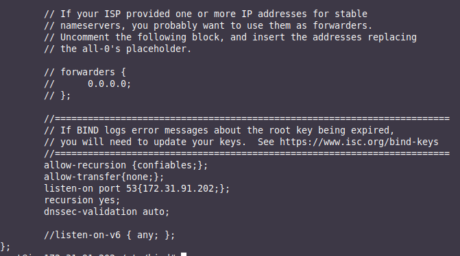
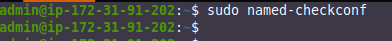
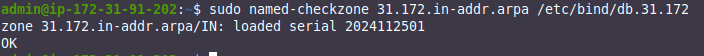
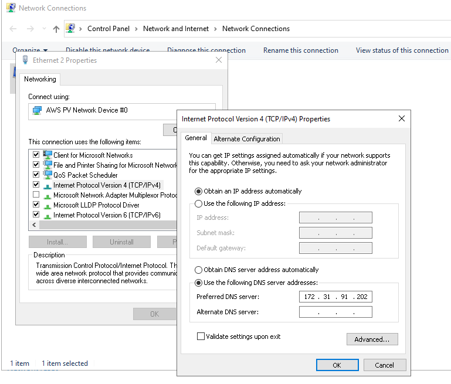
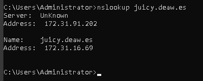
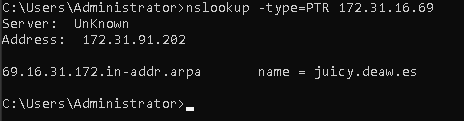
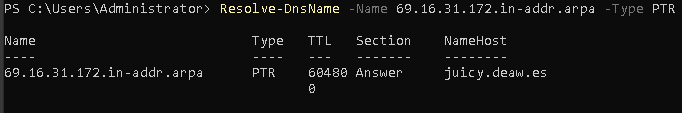

# Práctica 4.1 - Configuración de un servidor DNS

!!!note "Nota importante"
    Es muy importante que antes de empezar esta práctica eliminéis las entradas que habéis ido introduciendo hasta ahora en vuestro archivo ```/etc/hosts``` para asegurarnos que realmente la resolución de nombres va a nuestro servidor DNS. Si no hacéis esto, resolverá los nombres, pensaréis que está bien pero en realidad estará mal.

!!!note "Concepto importante antes de empezar"
    **Una IP es una dirección de 32 bits, o lo que es lo mismo, 4 bytes, separados entre ellos por puntos: 192.168.15.18**

## Instancias EC2 necesarias

Para esta práctica utilizaremos 3 máquinas:

 1. <u>Debian:</u> Será dónde instalaremos y configuraremos nuestro servidor DNS
 2. <u>Amazon Linux 2023:</u> Donde instalaremos la aplicación web Juicy Shop (podéis reutilizar la máquina de la práctica 4.2)
 3. <u>Windows:</u> Será el cliente que haga las peticiones DNS y desde donde haremos las comprobaciones (podéis reutilizar la máquina de la práctica 4.2)


## Instalación de servidor DNS

Bind es el estándar de facto para servidores DNS. Es una herramienta de software libre y se distribuye con la mayoría de plataformas Unix y Linux, donde también se le conoce con el sobrenombre de named (name daemon). Bind9 es la versión recomendada para usarse y es la que emplearemos.

Para instalar el servidor DNS en Ubuntu Server, usaremos los repositorios oficiales. Por ello, podremos instalarlo como cualquier paquete en Ubuntu:

```sh
sudo apt-get install bind9 bind9utils bind9-doc 
```

## Configuración del servidor

Puesto que en clase sólo vamos a utilizar IPv4, vamos a decírselo a Bind, en su archivo general de configuración. Este archivo `named` se encuentra en el directorio:

```linuxconf
/etc/default
```

Y para indicarle que sólo use IPv4, debemos modificar la línea siguiente con el texto resaltado:

```linuxconf
OPTIONS = "-u bind -4"
```

El archivo de configuración principal `named.conf` de Bind está en el directorio:

```linuxconf
/etc/bind
```

Si lo consultamos veremos lo siguiente:


Este archivo sirve simplemente para aglutinar o agrupar a los archivos de configuración que usaremos. Estos 3 includes hacen referencia a los 3 diferentes archivos donde deberemos realizar la verdadera configuración, ubicados en el mismo directorio.

### configuración *named.conf.options*

Es  una  buena  práctica  que  hagáis  siempre  una  copia  de  seguridad  de  un  archivo  de configuración cada vez que vayáis a realizar algún cambio:

```sh
sudo cp /etc/bind/named.conf.options /etc/bind/named.conf.options.backup
```

Ahora editaremos el archivo `named.conf.options` e incluiremos los siguientes contenidos:

 + Por motivos de seguridad, vamos a incluir una lista de acceso para que sólo puedan hacer consultas recursivas al servidor aquellos hosts que nosotros decidamos.

    En nuestro caso, los hosts confiables serán los de nuestra red privada de AWS. Si consultamos en la sección de ***VPC*** cuál es nuestra dirección de red (privada), veremos algo así:

    
    
    
     Así pues, justo antes del bloque ```options {…}```, al principio del archivo, añadiremos otro bloque como el siguiente:


    ```linuxconf
        acl confiables {
        172.31.0.0/16;
        };
    ```
Si nos fijamos el servidor por defecto ya viene configurado para ser un DNS caché. El directorio donde se cachearán o guardarán las zonas es `/var/cache/bind`.

    ```linuxconf
    /var/cache/bind
    ```


+ Que sólo se permitan las consultas recursivas a los hosts que hemos decidido en la lista de acceso anterior

+ No permitir transferencia de zonas a nadie, de momento

+ Configurar el servidor para que escuche consultas DNS en el puerto 53 (por defecto DNS utiliza puerto 53 UDP) y en la IP de su interfaz de la red privada. <u>**Deberéis colocar la IP de la interfaz de vuestra Debian**</u>, puesto que resolverá las consultas DNS del cliente/s de esa red.

+ Permitir las consultas recursivas, ya que en el primer punto ya le hemos dicho que sólo puedan hacerlas los hosts de la ACL.

+ Además, vamos a comentar la línea que pone `listen-on-v6 { any; };` puesto que no vamos a responder a consultas de IPv6. Para [comentarla](http://astro.uni-tuebingen.de/software/bind/comments.html) basta añadir al principio de la línea dos barras `//`. También podría hacerse con una almohadilla pero aparecería resaltado con color ya que estos comentarios los suele utilizar el administrador para aclarar algún aspecto de la configuración.

    


Podemos comprobar si nuestra configuración es correcta con el comando:



Si hay algún error, nos lo hará saber. En caso contrario, nos devuelve a la línea de comandos. 

Reiniciamos el servidor y comprobamos su estado:


### Configuración *named.conf.local*

En este archivo configuraremos aspectos relativos a nuestras zonas. Vamos a declarar la zona “deaw.es”. Por ahora simplemente indicaremos que el servidor DNS es maestro para esta zona y donde estará ubicado el archivo de zona que crearemos más adelante:


### Creación del archivo de zona

Vamos a crear el archivo de zona de resolución directa justo en el directorio que hemos indicado antes y con el mismo nombre que hemos indicado antes.

El contenido será algo así (procurad respetar el formato):


Recordad de teoría que los registros SOA son para detallar aspectos de la zona autoritativa, los NS para indicar los servidores DNS de la zona y los A las IPs respectivas.

Donde aparecen las X debéis poner vuestras IPs privadas correspondientes, tanto de vuestro servidor DNS como de vuestro servidor web.

### Creación del archivo de zona para la resolución inversa

Recordad que deben existir ambos archivos de zona, uno para la resolución directa y otro para la inversa. Vamos pues a crear el archivo de zona inversa.

En primer lugar, debemos añadir las líneas correspondientes a esta zona inversa en el archivo
**`named.conf.local`**, igual que hemos hecho antes con la zona de resolución directa:


Y la configuración de la zona de resolución inversa:


!!!warning "Cuidado"
    Acordaos que cuando se produce cualquier resolución DNS, la lectura del término que se consulta se produce de derecha a izquierda (del dominio raíz hacia abajo).
    Esto quiere decir que los bytes de la IP que tenéis que poner en X.X son el 4º y el 3º respectivamente.

Podemos comprobar que la configuración de las zonas es correcta con el comando adecuado.

### Comprobación de las configuraciones

Para comprobar la configuración de la zona de resolución directa:


Y para comprobar la configuración de la zona de resolución inversa:



Si todo está bien, devolverá OK. En caso de haber algún error, nos informará de ello.

Reiniciamos el servicio y comprobamos el estado:


!!!warning "Atención"

    + <u>Es vital que en el grupo de seguridad haya una regla de entrada que permita el tráfico hacia el puerto del DNS desde nuestra dirección de red privada de AWS.</u>
    
    + **Es muy importante** que el cliente esté configurado para usar como servidor DNS el que acabamos de instalar y configurar. Debéis cambiar vuestra configuración de red para que la máquina con la que hagáis las pruebas utilice este servidor DNS como el principal:

          

### Comprobación de las resoluciones y de las consultas

Podemos comprobar desde los clientes las resoluciones directas con nslookup o con el mismo navegador web:
=== "Comprobación usando *nslookup*"
    

=== "Comprobación usando *navegador web*"
    

Y las resoluciones inversas:

Podemos comprobar desde los clientes las resoluciones inversas:
=== "Comprobación usando *nslookup*"
    

=== "Comprobación usando *ping*"
    

=== "Comprobación usando Powershell"
    


## Tarea a realizar

Hemos configurado el servidor DNS para que acepte peticiones DNS únicamente desde su red privada y de hecho, si lo pruebas desde tu propio ordendor, verás que no funciona.

!!!task "Tarea"

      + Configura el servidor para que acepte ahora peticiones desde el exterior (tu ordenador personal p.e.) y **resuelva la petición DNS de `juicy.deaw.es` a su IP pública.**

      + Realiza las mismas dos comprobaciones, únicamente de resolución directa, de antes, mediante nslookup y mediante navegador web.

!!!tip "Recordatorio y pistas"

    + Para que en la lista de acceso se permitan peticiones DNS desde cualquier red/máquina, debéis sustituir la IP por el valor `any`.

    + Se debe abrir el puerto para DNS a cualuier IP.
    
    + Recuerda que se debe configurar que el servidor DNS a utilizar por el sistema sea el que acabas de configurar en AWS (su IP pública obviamente)

Recuerda que con nuestra configuración actual, para acceder a los sitios web necesitaremos añadir el dominio `deaw.es` en el nombre.

!!!caution "Atención para el informe"
    Documenta toda la práctica con	las	capturas de	pantalla correspondientes de cada configuración y comprobación.

## Cuestiones finales

!!!Task "Cuestión 1"
    ¿Qué pasará si un cliente de una red diferente a la tuya intenta hacer uso de tu DNS de alguna manera, le funcionará?¿Por qué, en qué parte de la configuración puede verse?
    
!!!Task "Cuestión 2"
    ¿Por qué tenemos que permitir las consultas recursivas en la configuración?
    
!!!Task "Cuestión 3"
    El servidor DNS que acabáis de montar, ¿es autoritativo?¿Por qué?

!!!Task "Cuestión 4"
    ¿Dónde podemos encontrar la directiva $ORIGIN y para qué sirve?

!!!Task "Cuestión 5"
    ¿Una zona es idéntico a un dominio? 

!!!Task "Cuestión 6"
    ¿Pueden editarse los archivos de zona de un servidor esclavo/secundario?

!!!Task "Cuestión 7"
    ¿Por qué podría querer tener más de un servidor esclavo para una misma zona?

!!!Task "Cuestión 8"
    ¿Cuántos servidores raíz existen?

!!!Task "Cuestión 9"
    ¿Qué es una consulta iterativa de referencia?

!!!Task "Cuestión 10"
    En una resolución inversa, ¿a qué nombre se mapearía la dirección IP 172.16.34.56?

|


