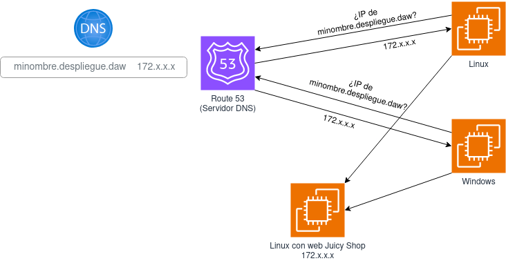
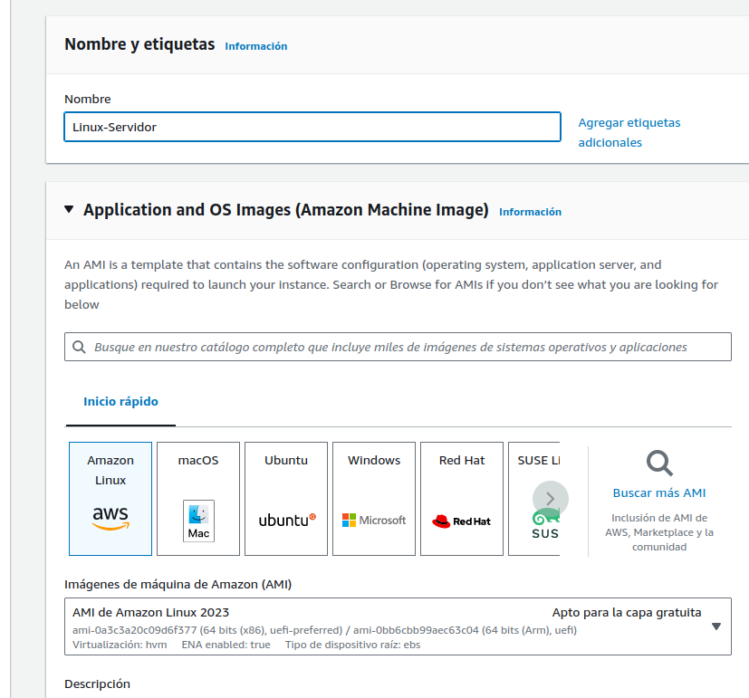
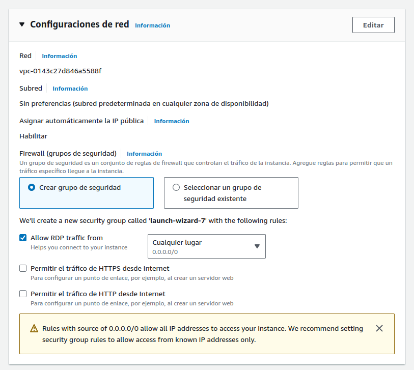
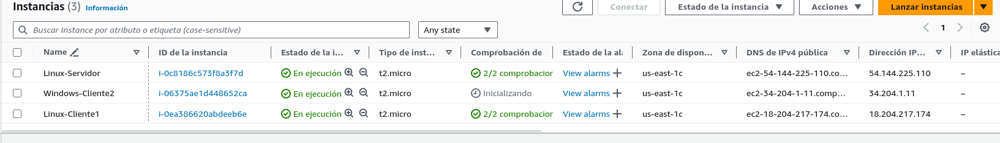
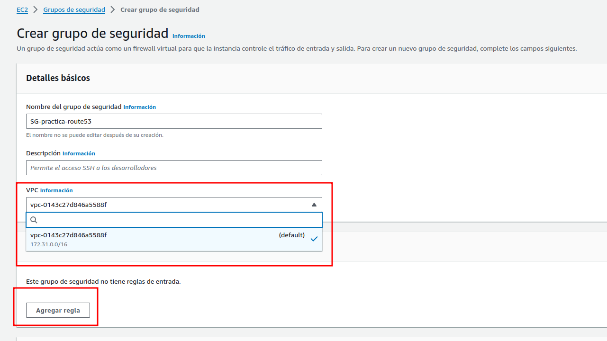
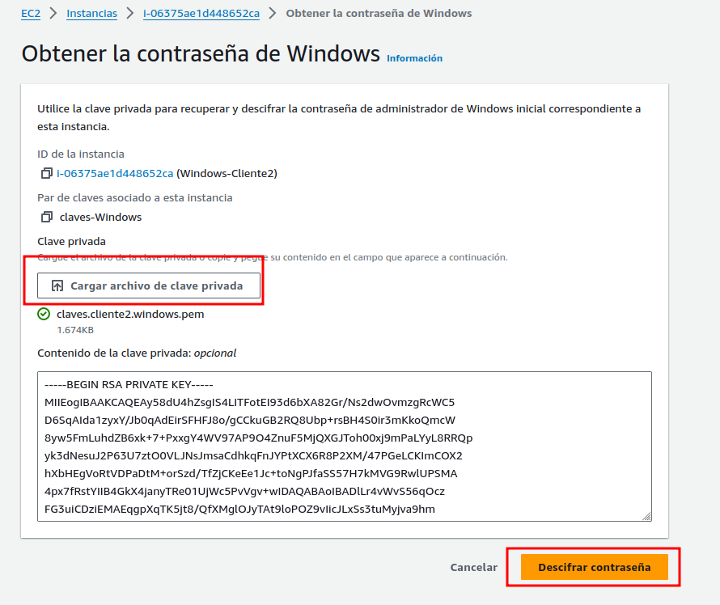
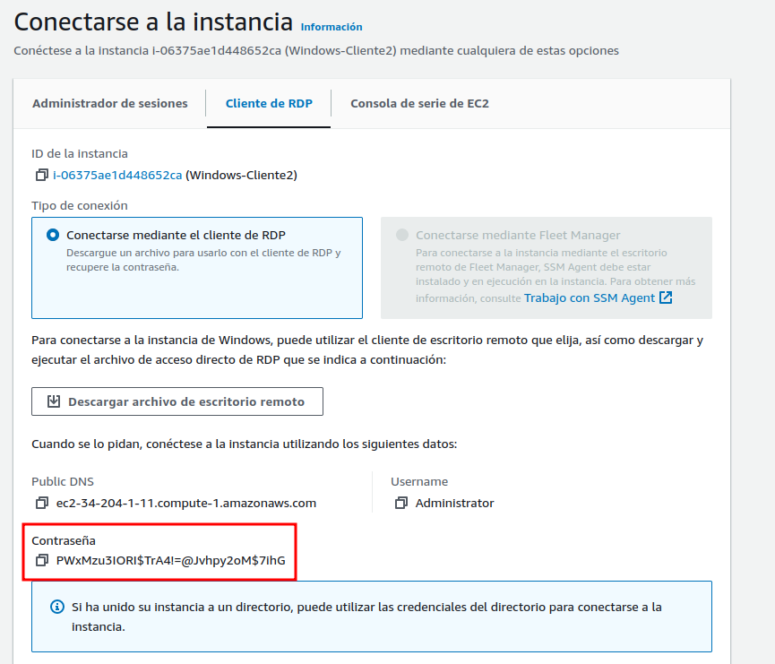
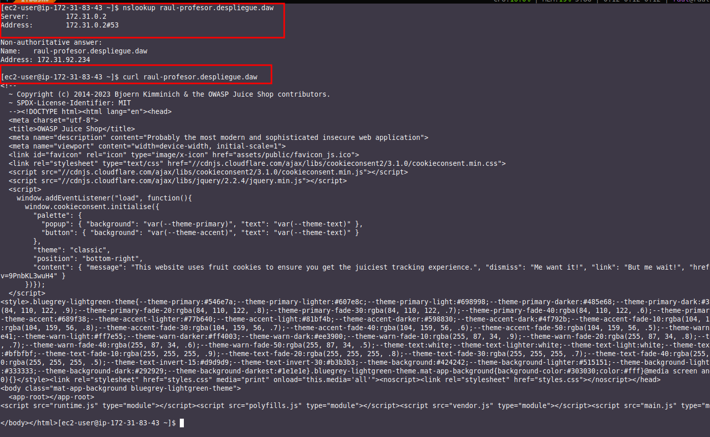

# Práctica 4.1 - Configuración de Route 53 (DNS) en AWS

## Introducción
En este caso vamos a realizar una práctica similar a la anterior pero configurando el servidor DNS en un entorno de AWS.

Citando textualmente la [documentación de Amazon](https://docs.aws.amazon.com/es_es/Route53/latest/DeveloperGuide/Welcome.html):

!!!quote "Cita"
    Amazon Route 53 es un servicio web de sistema de nombres de dominio (DNS) escalable y de alta disponibilidad. Puede utilizar Route 53 para realizar tres funciones principales en cualquier combinación: registro de dominio, direccionamiento de DNS y comprobación de estado.
    




## Creación instancias EC2

Vamos a crear 3 instancias EC2:

1. Linux con Docker corriendo la web Juicy Shop
2. Linux que actuará como cliente para realizar las consultas DNS
3. Windows que actuará como cliente para realizar las consultas DNS

En primera instancia, debemos iniciar nuestro Learner Lab.


## Proceso en imágenes




```bash title="Código"
#!/bin/bash 
yum update -y 
yum install -y docker 
service docker start 
systemctl enable docker.service
docker pull bkimminich/juice-shop 
docker run -d -p 80:3000 bkimminich/juice-shop
```

















